# Question bank and recovery exams

A student who missed some classes can sit an **extraordinary (recovery) exam** that only covers the lessons they missed — or the whole subject. The manager (or the teacher of the subject) picks the lessons, Flylogs builds the exam from the subject's **question bank**, and the result is kept in the student's enrollment.




**Who can do this.** Training managers work on every subject of the company. Teachers (and flight instructors) can only generate, assign and grade recovery exams for the **subjects they teach**. Students only see the recovery exams opened for them. 


### 1. Lesson codes

Every lesson can have a short **Code** (for example `010-02`, or an EASA learning objective such as `010.02.01`). Open the lesson, type the code and save.

* The code is free text, up to 30 characters.
* It must be **unique inside the subject** (upper/lower case is ignored). Saving a code already used by another lesson of the subject is refused.
* Codes are optional, but only tagged questions can be picked "by lesson".

<figure>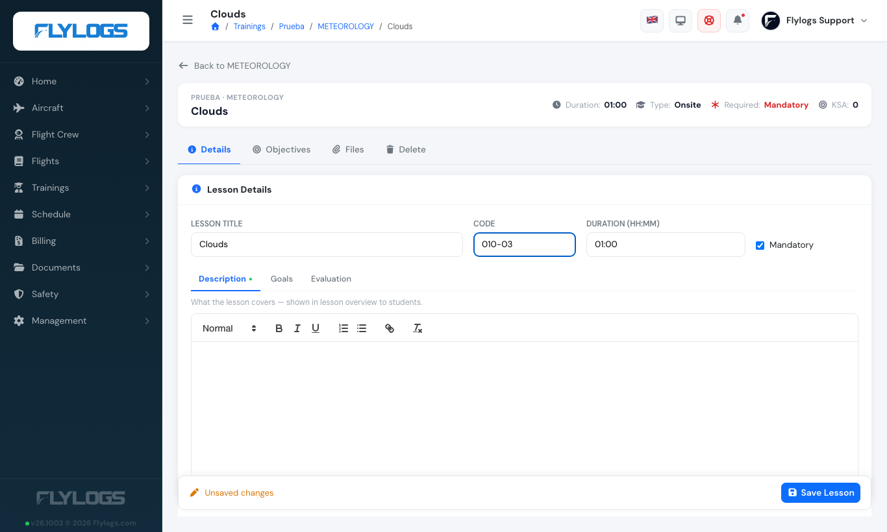<figcaption>
The lesson edit page: the new **Code** field (here Clouds → 010-03).
</figcaption></figure>
<figure>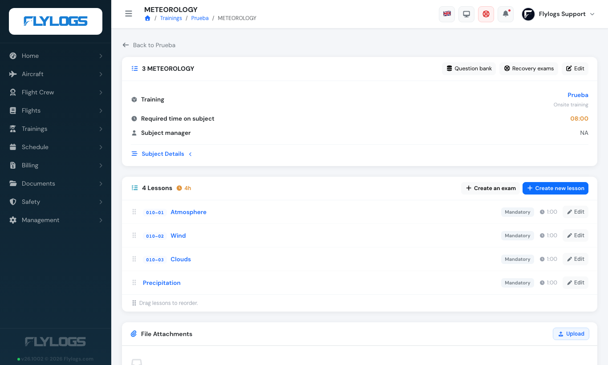<figcaption>
On the subject page each lesson shows its code, and the new **Question bank** and **Recovery exams** buttons sit in the header.
</figcaption></figure>

### 2. Tagging the questions: the Question bank

Open the subject and press **Question bank**. It lists every question of the subject, 25/50/100 per page.

* Filter by **lesson code**, show only **untagged** questions, or search the text.
* Select one or many questions and **Tag selected with lesson…**; choose **clear tag** to remove it.
* A question has **one** lesson code. It still belongs to the subject's bank (not to the lesson), so it can be reused in any exam of the subject.
* Codes found on questions that match no lesson of the subject are listed as a warning.

<figure>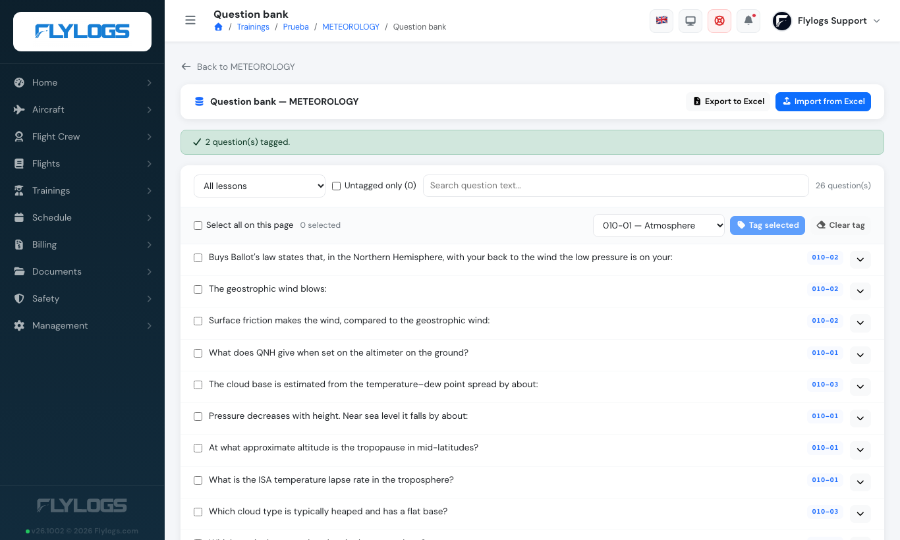<figcaption>
The Question bank of a subject: every question with its lesson-code tag.
</figcaption></figure>
<figure>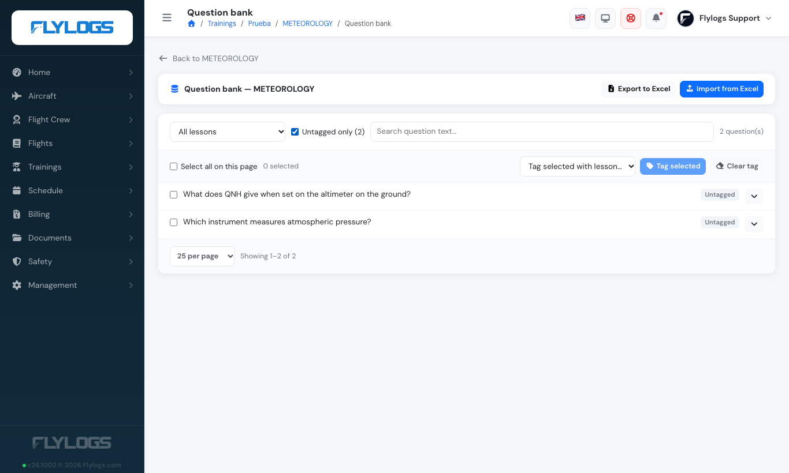<figcaption>
Filter **Untagged only** to find the questions that still have no lesson.
</figcaption></figure>
<figure>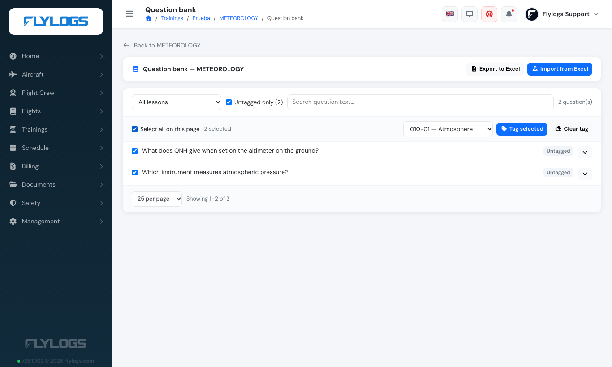<figcaption>
Select questions and **Tag selected with lesson…**.
</figcaption></figure>

**Excel.** **Export** writes every question with its code; **Import** reads the same layout:

| | A | B | C |
|---|---|---|---|
| Question row | question text | `?` | **lesson code** |
| Option rows | option text | any value when it is the correct answer | |

Re-importing a file **updates** the lesson code of questions that already exist (same text in the subject); it never creates duplicates. Rows with an unknown lesson code, or without a correct option, are reported and skipped.

<figure>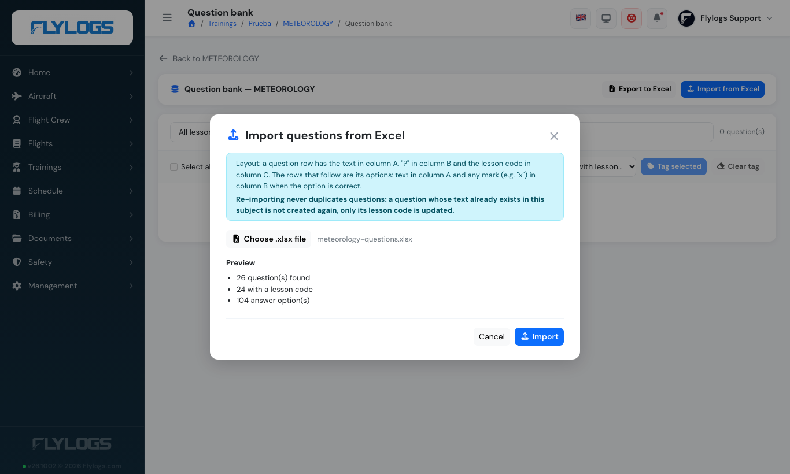<figcaption>
The import preview shows how many questions were found and how many carry a lesson code.
</figcaption></figure>
<figure>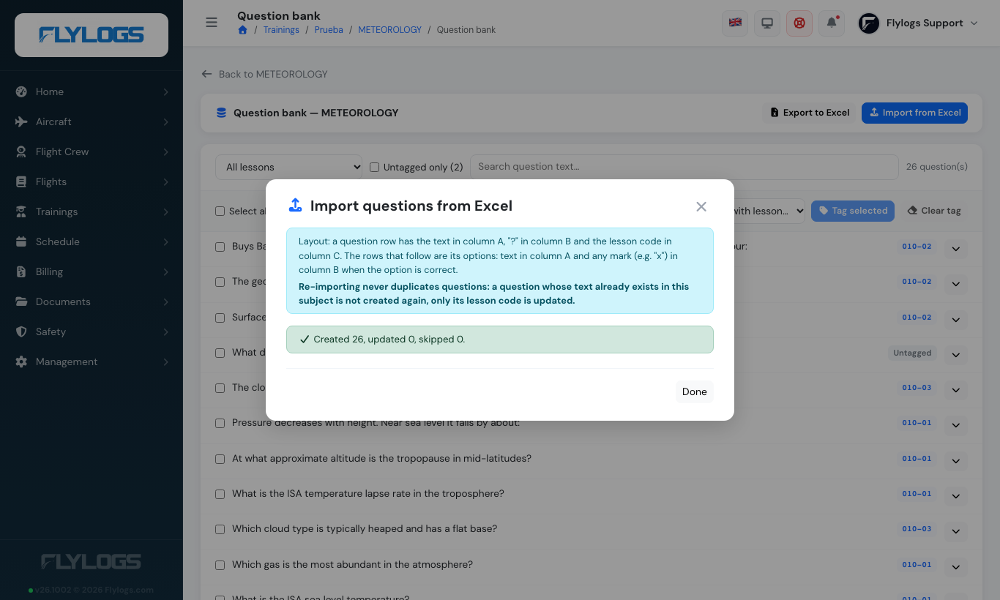<figcaption>
The result: created, updated and skipped questions, with the reason for each skipped row.
</figcaption></figure>

### 3. Generate a recovery exam

On the subject press **Recovery exams → Generate exam**.

1. **Lessons.** Tick the lessons by code (one, a few, or **whole subject**). Flylogs shows how many questions each has. Option: also use questions of the same subject in your other courses (on by default; subjects match by subject code or template). Option: include untagged questions (off by default).
2. **Settings.** Number of questions, pass mark (default 75%), time limit, attempts (default **1**), show answers. The name is filled in for you.
3. **Create.** If the pool has fewer questions than requested you are told how many are available.


**Balanced questions.** Questions are drawn evenly across the chosen lessons (round-robin from shuffled lists, then the final order is shuffled), so an exam is never dominated by one lesson. If a lesson has too few questions its share goes to the others. With a single lesson, every question comes from it. The same balanced draw is used for the questions of regular subject and course exams.


Every student draws **their own** set of questions (online at the start of each attempt; on paper once per printed exam).

<figure>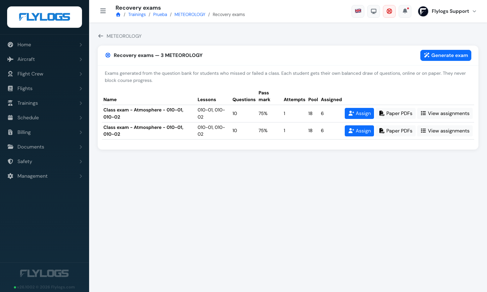<figcaption>
The Recovery exams page of a subject.
</figcaption></figure>
<figure>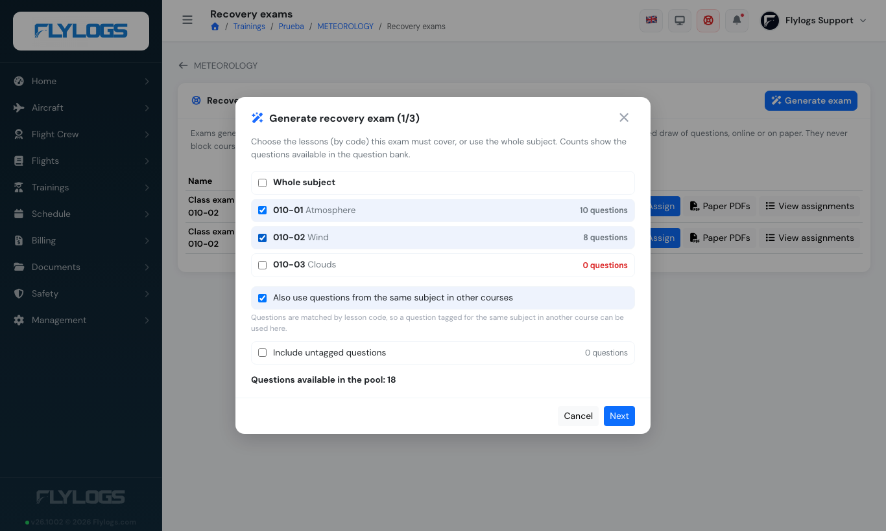<figcaption>
Step 1 of the generator: choose lessons by code and see how many questions each has.
</figcaption></figure>

### 4. Give it to students

**Assign** the exam from the recovery exams list:

* to **specific students** (enrollments of the course), or to **all students of a session**;
* **Online** (the student takes it in Flylogs within an *available from / until* window, default 10 days) or **Paper** (printed);
* optionally the **missed class** each student is catching up on.

Teachers can also **open the exam of a lesson to the students of a session** from the session page: the exam becomes available to everyone rostered on that session for its access window.

Students see the exam under **Recovery exams** in their course, labelled *Extraordinary*. It never blocks progress or course completion.

<figure>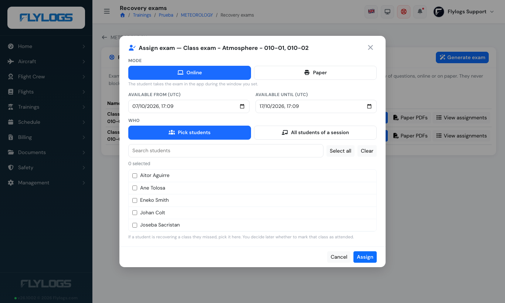<figcaption>
Assigning an exam to selected students, online or on paper, with its availability window.
</figcaption></figure>
<figure>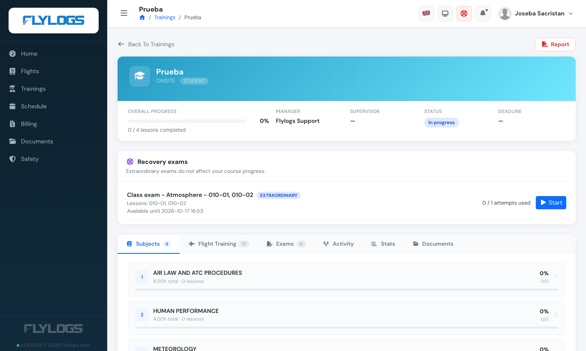<figcaption>
What the student sees in their course as soon as the exam is open.
</figcaption></figure>
<figure>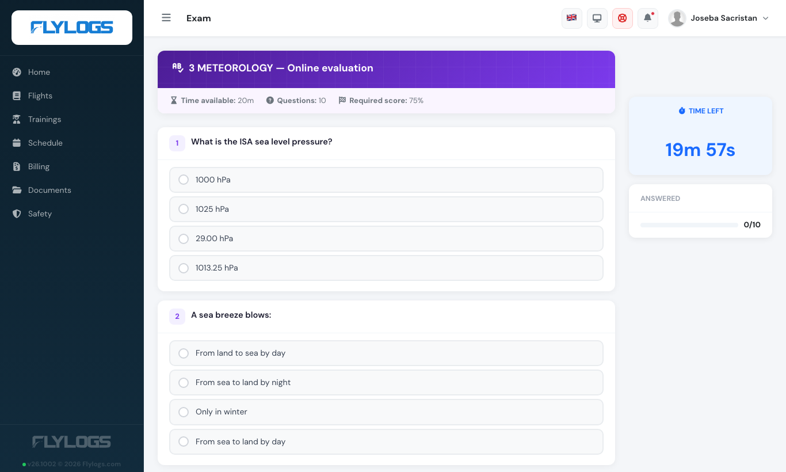<figcaption>
The student answers the questions…
</figcaption></figure>
<figure>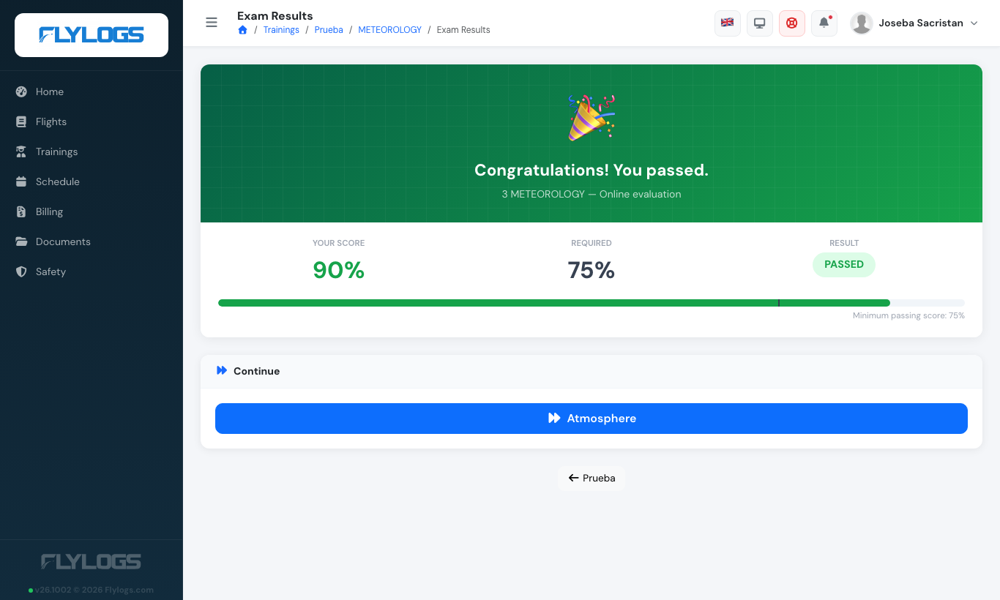<figcaption>
…and sees the result immediately.
</figcaption></figure>

### Generate an exam straight from a class

<figure>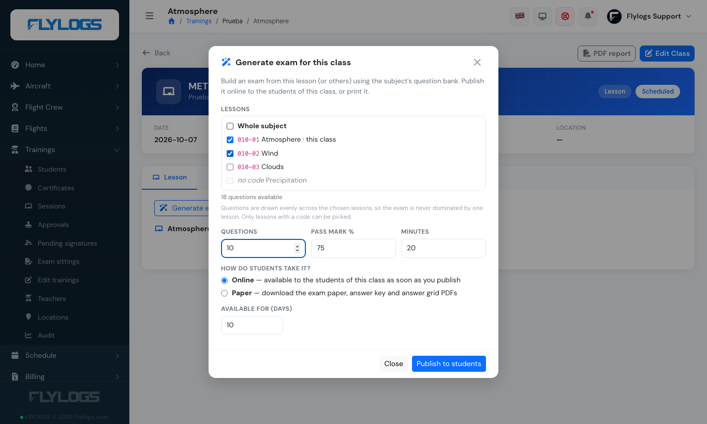<figcaption>
On the class page: this lesson is pre-selected, add more lessons if you want, choose the number of questions and **Online** or **Paper**.
</figcaption></figure>
<figure>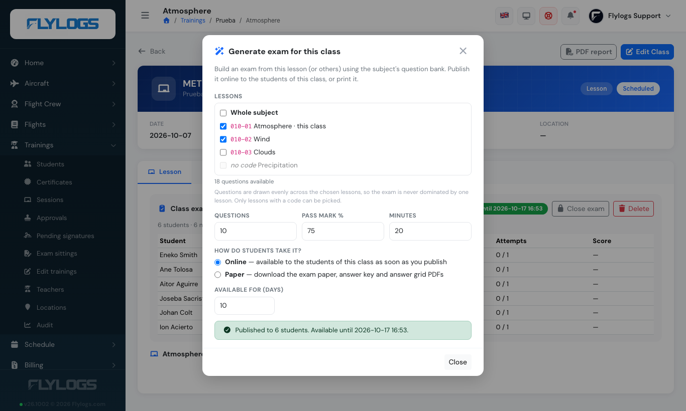<figcaption>
Publishing opens the exam to every student of the class straight away.
</figcaption></figure>

On the class page (Lesson tab) press **Generate exam for this class**. The lesson of the class is pre-selected (it needs a lesson code); you can add other lessons or pick the whole subject. Set the number of questions, pass mark and time, then choose:

* **Online** — the exam is created and **published immediately to the students of the class**. They see it under *Recovery exams* in their course and can start it straight away, for the number of days you set (default 10).
* **Paper** — the exam is created for the students of the class and the **exam paper, answer key and answer grid PDFs** are downloaded (1–4 versions).

Questions are drawn evenly across the chosen lessons, as described above. Available to managers and to the teacher of the class while the class is not signed. Once an exam is open, the top of the Lesson tab shows its **status**: open until when, and for every student *not started / in progress / passed / failed* with attempts and score (refreshed every 30 seconds).

<figure>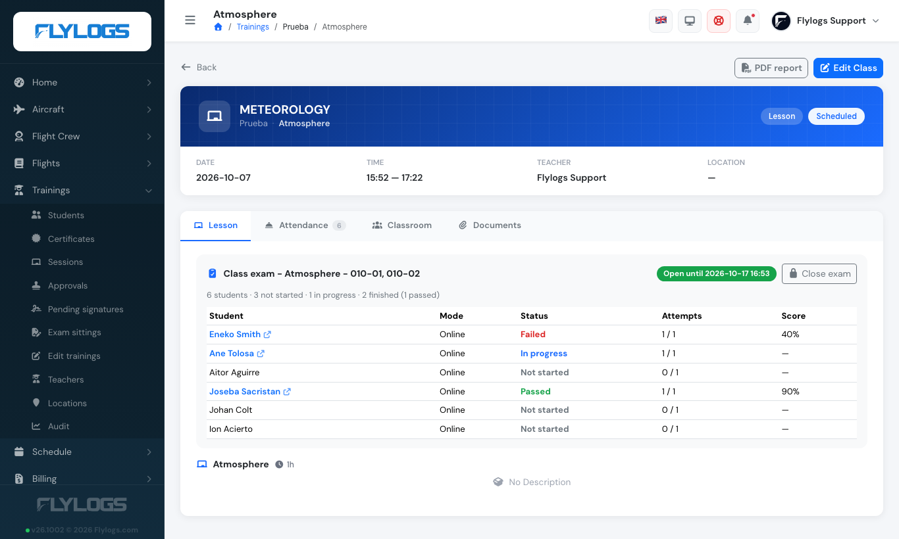<figcaption>
The class page while the exam is open: not started, in progress, failed and passed students.
</figcaption></figure>
<figure>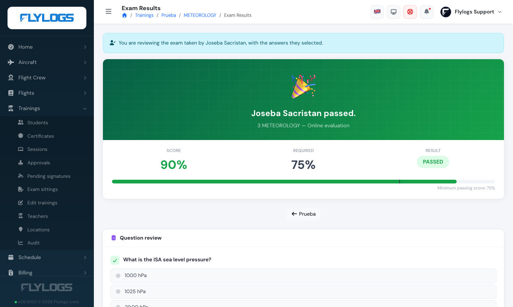<figcaption>
Clicking a student's name opens the exam they took…
</figcaption></figure>
<figure>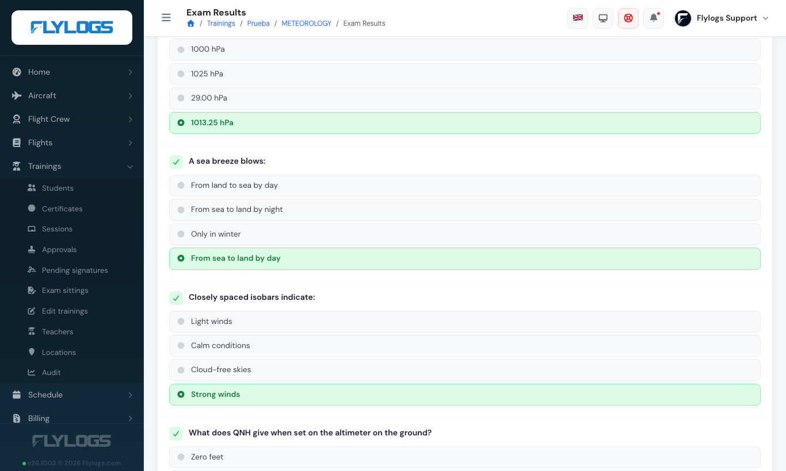<figcaption>
…with the option they selected (red when wrong) and the correct answer.
</figcaption></figure>
 Click a **student's name** to open, in a new tab, the exam that student took — every question with the option they selected and the correct answer. **One exam at a time:** while an exam is open for the class, the *Generate exam* and *Open exam to students* options are hidden (and refused by the server). Use **Close exam** (it asks for confirmation) to stop students from starting it — results already recorded are kept and you can open it again later — or **Delete** to remove an opening made by mistake. Delete is only offered while nobody has results; a recovery exam generated only for this class is deleted with it. The existing **Open exam to students** box on the same page opens a lesson exam or an already generated recovery exam.

### 5. Paper exams and PDFs

<figure>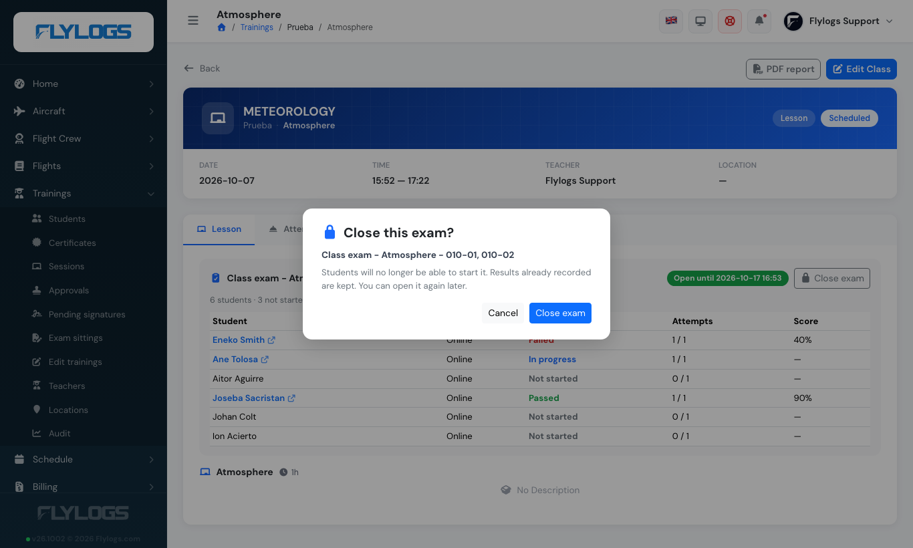<figcaption>
Closing an exam keeps all the results and lets you open another one.
</figcaption></figure>
<figure>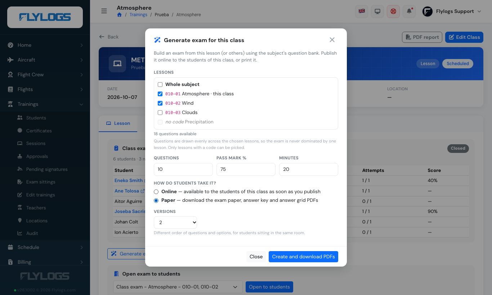<figcaption>
Choosing **Paper** creates the exam and downloads the PDFs.
</figcaption></figure>

Choose the paper assignments and the number of versions (1–4). Versions contain the same questions of each student in a different order, so students sitting next to each other do not share the same sheet. Three PDFs:

* **Exam paper** — school logo, course, subject, lessons covered, boxes for name, date and signature, numbered questions with options A–D, no answers.
* **Answer key** — a separate PDF for the instructor with the correct letter of every question.
* **Answer grid** — one page where the student marks A/B/C/D.

<figure>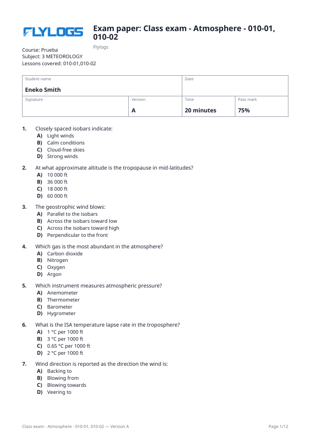<figcaption>
Exam paper: logo, course, subject, student, version, time and pass mark; no answers.
</figcaption></figure>
<figure>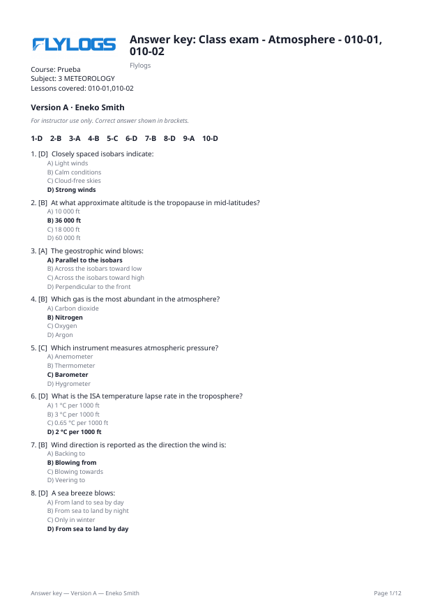<figcaption>
Answer key for the instructor.
</figcaption></figure>
<figure>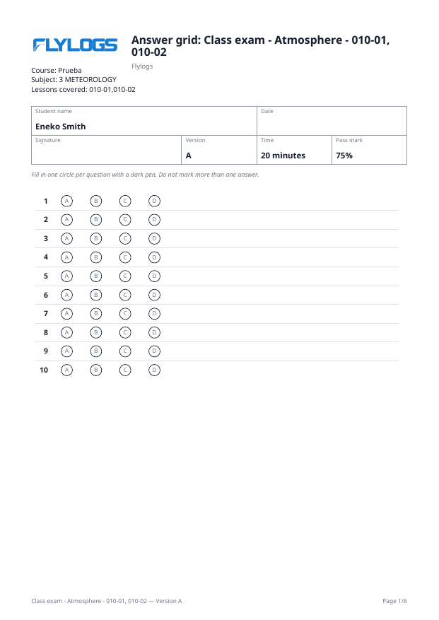<figcaption>
Answer grid for the student.
</figcaption></figure>
<figure>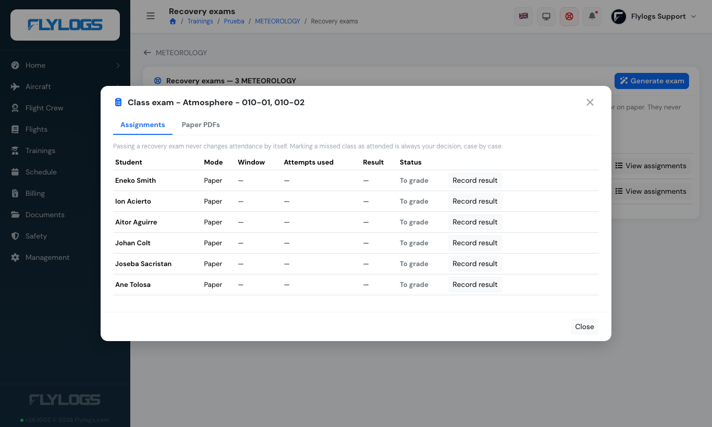<figcaption>
Recovery exam assignments: record paper results here.
</figcaption></figure>

After marking, press **Record result** on the assignment: type the **score** and **passed / failed**.

### 6. The enrollment record

<figure>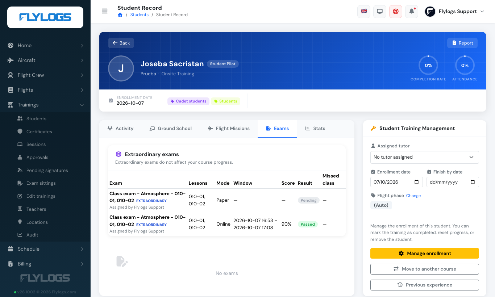<figcaption>
The student record lists every extraordinary exam with its lessons, mode, window, score and result.
</figcaption></figure>

Every recovery exam appears on the student's enrollment (and in the training report, labelled **Extraordinary**): lessons covered, date or window, mode, score, result and the missed class it relates to.

When a student passes and a missed class is linked, the manager decides **case by case** whether to mark that class **Attended (post-class)**. Flylogs never changes the attendance by itself. See [Missed classes and class work](missed-classes-and-class-work.md).


Recovery exams are not course content: they do not appear in the subject's regular exam list, in the course structure or in progress calculations. They are managed from **Recovery exams**, the class page and the student's enrollment.


### Access summary

| Action | Who |
|---|---|
| Edit lesson codes, tag questions, import/export, generate, assign, record paper results, set post-class attendance | Training managers; teachers only on subjects they teach |
| Take an online recovery exam | The assigned student, inside the window, up to the attempts allowed |
| See own recovery exams | The student |
