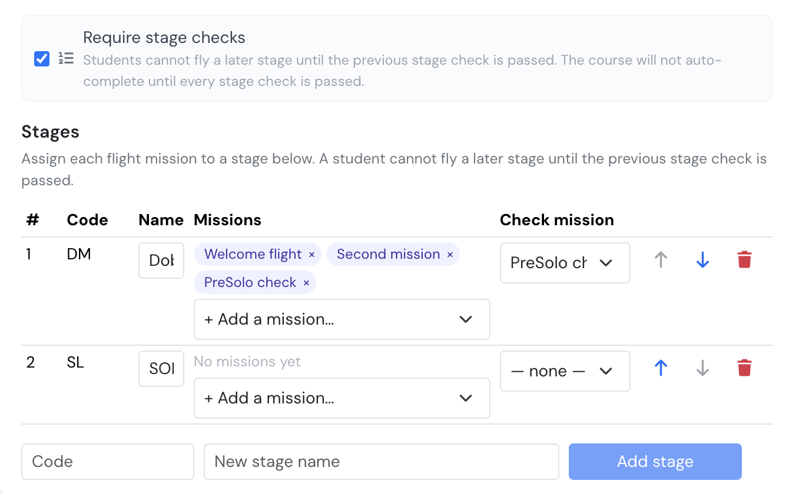

# Stage Checks

A **stage** is an ordered block of flight missions that ends in a check. Until that check is passed, the student cannot fly any mission in a later stage.

Stage checks are **off by default**. Nothing changes on any existing course until you switch them on.

### Turning stage checks on

Open the training's **Settings** page and tick **Require stage checks**, in the Student evaluation card. The option appears only on trainings that have flight missions enabled.

<figure><figcaption>
Require stage checks, with the stage editor below it
</figcaption></figure>

Two things change once it is on:

* A student is blocked from flying a mission in a later stage while an earlier stage check is outstanding or failed.
* The course no longer completes automatically while any stage check is still owed, even when every mission and activity is done.

### Defining stages

The stage editor appears under the checkbox once stage checks are enabled.

Give each stage a short **code** and a **name** — for example `DM` / *Doble Mando*, then `SL` / *SOLO* — and order them with the arrows. Order matters: it is what decides which stage blocks which.

**Assign missions to a stage** with the **+ Add a mission…** picker in that stage's row. The picker only lists missions that are not yet in a stage, so a mission can never be in two places. Remove one with the **×** on its chip.

A mission that belongs to no stage is never blocked — worth remembering if a student seems able to fly something you expected to be gated.

You can nominate one of a stage's missions as its **check mission** — the flight the check is normally conducted on. The dropdown only offers missions already assigned to that stage, so assign first, then pick. It is a label for your instructors; the check result is recorded separately.

**Deleting a stage does not delete its missions.** They are simply left without a stage, and the confirmation tells you how many are affected.

### Seeing the stages on your course

In the training's **Flight Missions** tab each mission shows its stage code, and the totals box breaks the course down by stage as well as by flight type. A mission with no stage shows a dashed *No stage* marker, so gaps are visible at a glance rather than having to be inferred.

### Recording a stage check

When a student has flown every mandatory mission in a stage, that stage shows **Stage check due** and every later stage shows as **Blocked**.

Open the student, go to the **Flight missions** tab, and use the buttons on the stage:

* **Record pass** — the stage is cleared and the next stage opens.
* **Record fail** — the stage stays due and later stages stay blocked. The student can be re-checked; the next result is recorded as a new attempt.
* **Override** — lets the student continue without a pass. A written reason is required.

Each of these asks for your password, exactly like signing a flight debriefing. What gets stored is who signed, when, from which address and browser, plus a hash of those details that would reveal any later alteration of the record.

### Correcting a mistake

Results are never edited. If one was recorded wrongly, **Void** it and give a reason. The voided result stays visible, struck through, and the previous result decides the student's state again.

This is deliberate: an inspector should be able to see that a correction happened, who made it and why.

### Who can do what

| Action | Who |
| ------ | --- |
| Enable stage checks, define and order stages, assign missions | Company Administrator, Operations Manager, Compliance & Safety Manager, Human Resources Manager, Financial Manager, Trainings Manager, or the training's own manager |
| Record, override or void a stage check | The same people |
| See a stage strip and its history | The above, plus the enrolled student for their own enrollment |

An instructor who is not the training's manager can fly and record missions as before, but cannot sign a stage check. If you need instructors to sign individual missions out, see [Mission Authorizations](mission-authorizations.md).
