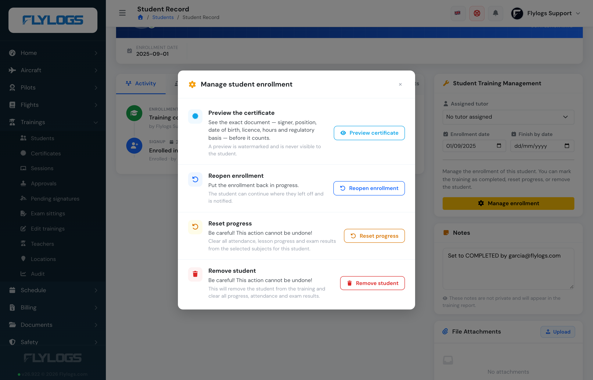
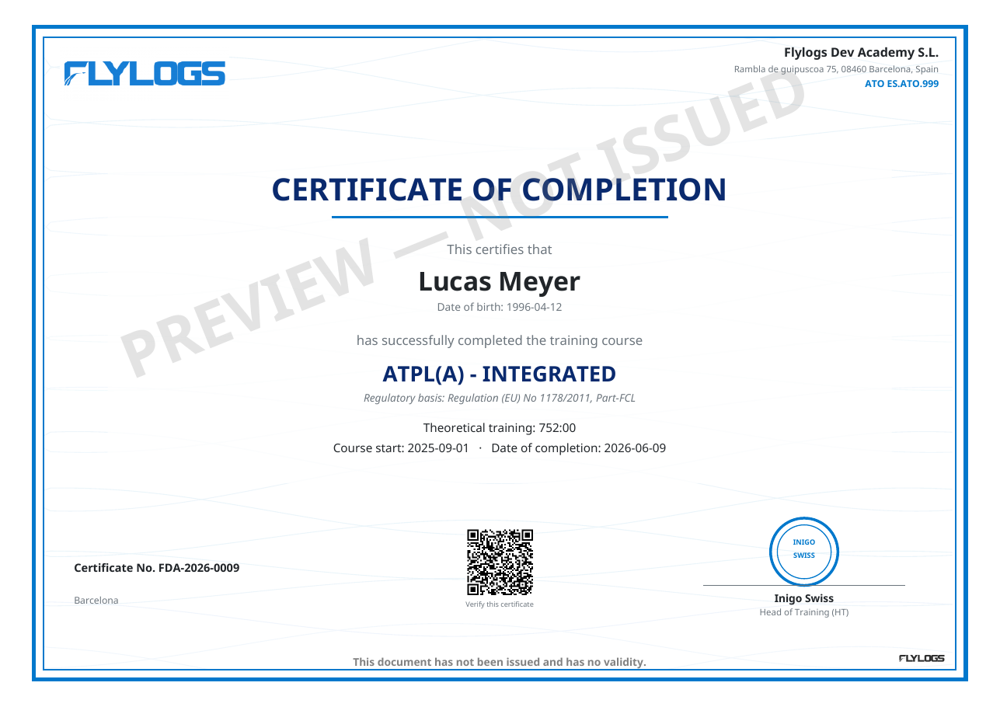
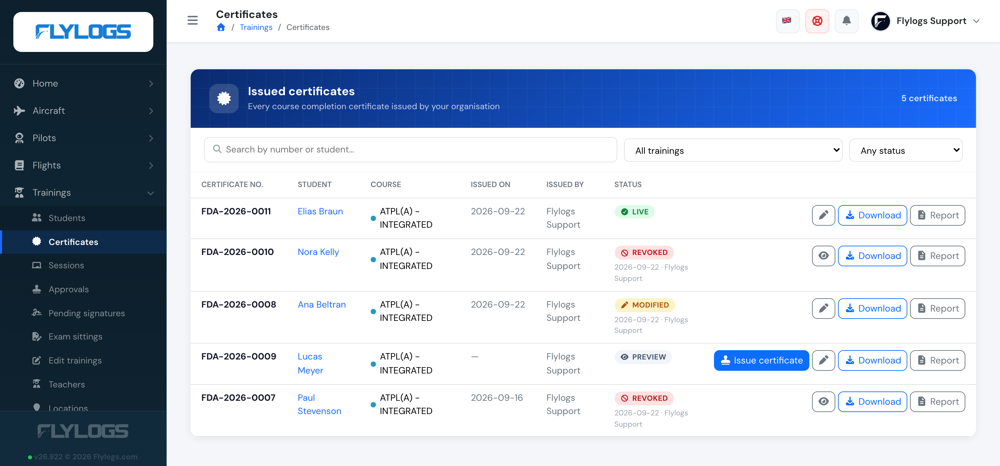
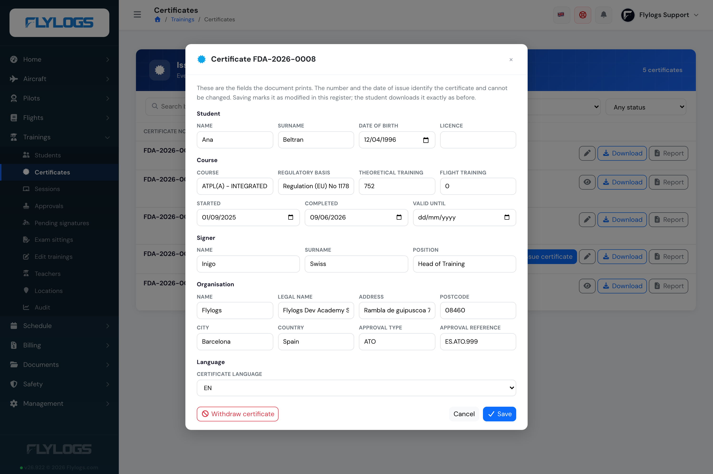
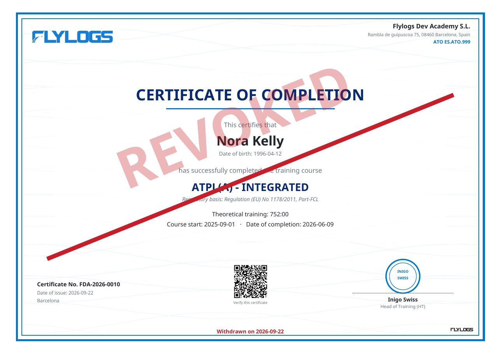
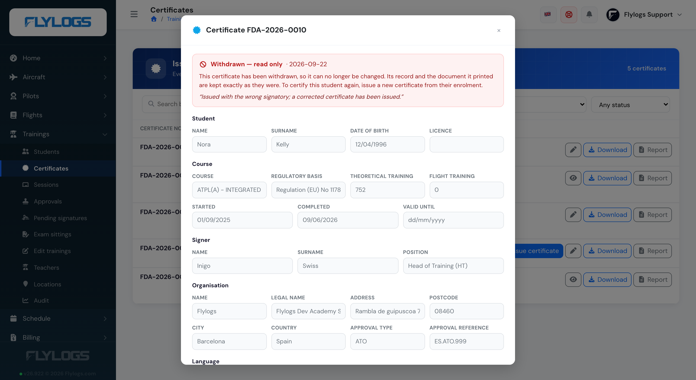
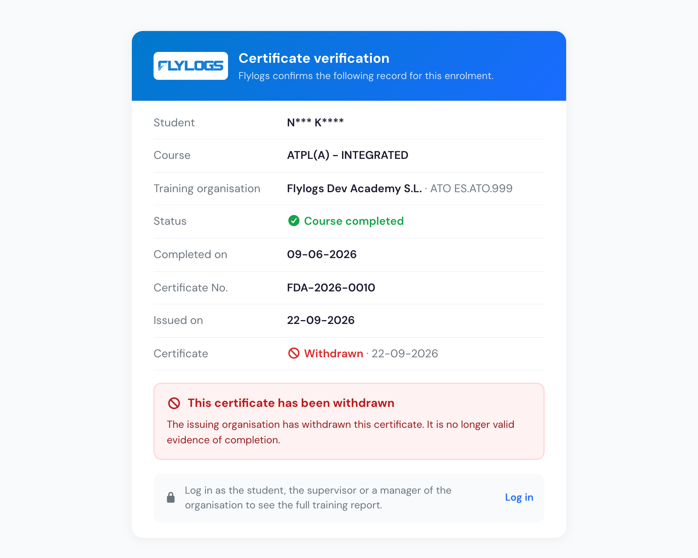

# Student management

Flylogs training allows any existing user in your company to be enrolled as a student. This means that any staff member, technical personnel, client, or student can be enrolled in a training program of your choice.

To get started, go to the "**Trainings**" menu tab and click on "**STUDENTS**." On this page, you'll see the students currently enrolled in the selected training. You can choose any of your trainings, and the list will update to display all existing students and their progress.

**Who can see this page:** company managers (Administrator, Operations, Compliance & Safety, HR, Financial and Trainings Manager), Chief Pilot, Flight Instructors and external auditors. Flight Instructors and auditors get a **read-only** view: they can open any student's record but cannot enroll, edit, complete or reset an enrollment — those actions are limited to staff up to and including Chief Pilot.

#### Enrolling new students

First, you'll need to add your students to one of your courses. To do this, click on the blue button labeled "Enroll students" in the top right corner. A small pop-up window will appear. In this window, you can choose students individually, or you can enroll an entire pilot group at once. We recommend creating pilot groups for each academic year and adding them in batches. This will make management easier, especially when you have multiple classes to oversee in the future.

Select the training in which you want to enroll the user(s). Additionally, you have the option to choose a tutor for the newly enrolled users or set a finish-by date if desired.

Anyone who is already on the course is left alone: if a selected pilot group includes students who are training on that course right now, they keep the enrollment they have and the pop-up tells you how many were skipped. A student who appears in two selected groups is enrolled once, not twice. Students whose previous enrollment on the course is **closed** — completed, stopped, failed or expelled — are treated as re-takes and do get a new enrollment, with the old record kept alongside it, so take care when you re-add a group whose members have already finished the course.

<figure><figcaption>
Enroll new students pop up window.
</figcaption></figure>
#### Students report page

Once you've enrolled at least one student, the current page will show a report detailing the progress of students enrolled in the selected training. This report, similar to the one in the screenshot below, provides essential information for tracking student progress. It includes details such as progress in theory learning lessons, flight training mission progress, attendance records, and the date of the last flight, if applicable.

<figure><figcaption>
Students report page
</figcaption></figure>

**Who can see this:** company managers (training manager, operations manager and above) and external auditors. Flight instructors do not get the **Students** entry in the Trainings menu; they open a student's training record from the pilot profile instead — go to **Pilots**, open the student, and click the course in the **Trainings** box. That record is the same progress page described below, read-only for instructors.
#### Student training progress page

You'll find a comprehensive training progress report page for each of your students. This page, as shown in the screenshot below, details progress and attendance in ground school lessons, exams, and flight missions. Additionally, it offers basic analytics to help you understand the strengths and weaknesses of each student.

Clicking on any of your students will open the complete progress report for that student in the selected training. Keep in mind that if a student is enrolled in more than one training, they will have a separate training report page for each training they are enrolled in.

These training reports for the student can also be accessed from the pilot profile page in the Trainings box.

<figure><figcaption></figcaption></figure>
<figure><figcaption></figcaption></figure>
#### Attendance breakdown

For onsite trainings, the attendance ring on the student's progress page breaks missed sessions down further, so a low attendance rate isn't a mystery:

* **Missed** — the total number of sessions the student did not attend.
* **Justified** — of those, how many have an approved absence justification.
* **Not justified** — how many are still a plain, unresolved absence.
* **Credited after class** — how many were later marked **Attended (post-class)**, i.e. the student made up the class afterwards. When some of those were recovered by attending another sitting of the same lesson (see [Recovering a class in another sitting](missed-classes-and-class-work.md#recovering-a-class-in-another-sitting)), that number is shown alongside.

The same split carries through to the training report and its PDF. See [Missed classes and class work](missed-classes-and-class-work.md) for how a student gets from "Absent" to one of these outcomes.

<!-- SCREENSHOT TODO — add trainingsAttendanceBreakdown.png to .gitbook/assets/, then uncomment:

<figure><figcaption>
Missed sessions split into justified, not justified and credited after class.
</figcaption></figure>

-->
#### Students invited but not enrolled

Someone can be invited to an individual class without being enrolled in the training itself — useful for a one-off visitor or a student you haven't formally enrolled yet. They can open the class page, but no attendance or evaluation can ever be recorded for them: on the class register they show up read-only with a **Not enrolled** label, and they're left out of the attendance ratio, the missed-class email and the class work notification.

They also won't appear on this training's student report or progress pages, since there's no enrollment to report on. To record their attendance and results, enrol them in the training — from that point on they're treated like any other student.

<!-- SCREENSHOT TODO — add trainingsNotEnrolledInvitee.png to .gitbook/assets/, then uncomment:

<figure><figcaption>
A "Not enrolled" invitee on a class register, shown read-only.
</figcaption></figure>

-->
#### Marking a training as completed, and the completion date

Most courses complete themselves: as soon as the last lesson, exam and flight mission is done, the enrollment is closed automatically and the certificate becomes available. When you need to close one by hand — a course finished on paper, or a student who finished before you set the course up in Flylogs — open their training progress page, click "**Manage enrollment**" and choose "**Mark as completed**".

Flylogs then asks you for the **completion date**, prefilled with the date the records say the student actually finished: the latest of their last completed lesson, last passed exam and last completed flight mission. Change it if the real date was different.

That date matters, because it is the date printed on the certificate and the date its expiry is counted from. A student who finished on a Thursday but is only marked completed two weeks later still gets a certificate dated that Thursday, valid for the full period from then — not one dated the day you pressed the button.

The date cannot be in the future, and cannot be earlier than the day the student was enrolled. Where nothing has been recorded for the student yet, the field simply defaults to today.

**Who can do this:** company managers. Instructors, students and external auditors cannot mark an enrollment as completed or change its completion date.

#### The course completion certificate

Once an enrollment is completed, the certificate can be downloaded from the student's training progress page (managers), from the Students overview, and by the student themselves from their training page — unless **Show certificate to students** is switched off on the training, or the certificate is still a [preview](#check-the-certificate-before-you-issue-it) or has been [withdrawn](#withdrawing-a-certificate). It is the training organisation's document, printed in the **company language**:

* **Organisation** — legal name, address, approval type and reference from **Company settings → General → Training organisation**.
* **Student** — full name, date of birth (from the pilot profile) and licence. The licence line is the **name of the student's valid licence document** under *My Certificates* (type "Licence", not expired) — record the licence number there, e.g. `PPL(A) SI.FCL.12345`. Students with no licence get no licence line. Passport number, address and phone are never printed.
* **Course** — name, regulatory basis, **theoretical training hours** (the planned syllabus hours of the course subjects) and **flight training hours** (the block time actually flown on the student's completed missions, each flight counted once), the course start date (the enrolment date) and the completion date.
* **Issue** — the certificate number, the date of issue and the signature, name and position of the training manager (see [Edit a training](edit-a-training.md#certificate-signer-and-regulatory-basis)).

**Numbering.** A certificate is *issued* once. Flylogs reserves the next number from the company counter, stamps the date of issue and stores a copy of every printed field. Every later download — by the student, a manager, or from the certificates list — reproduces that same certificate. Editing the company details or the course afterwards does not alter a certificate already issued. That is deliberate: a certificate records what was certified on the day.

#### Check the certificate before you issue it

Because a certificate is frozen the moment it is issued, look at it first. On a completed enrollment, open "**Manage enrollment**" and choose "**Preview certificate**".

<figure><figcaption>
<em>Preview certificate</em> renders the real document before it counts.
</figcaption></figure>

The preview is the real document — the signer and their position, the date of birth, the licence, the hours, the regulatory basis and the whole organisation block — so anything wrong is visible before it is permanent. It is watermarked, prints no date of issue, and says in plain words that it has no validity. **The student can never download a preview**; it does not appear on their training page and the download is refused to them outright.

<figure><figcaption>
A preview: watermarked, no date of issue, and a line stating it has no validity.
</figcaption></figure>

When the document is right, press "**Issue certificate**" — in the same window, or from the row in **Trainings → Certificates**. The certificate keeps the number the preview already reserved, so issuing never renumbers anything, and the date of issue is stamped at that moment.

> **Courses that finish on their own are unaffected.** On a distance course where a student completes without anyone in the office involved, their own download issues a normal certificate exactly as before. A preview only exists because a manager asked for one.

#### The certificates register

**Trainings → Certificates** lists every certificate the organisation has: number, student, course, date of issue, who issued it and its **status**. Search by number or student, filter by course or by status.

<figure><figcaption>
The register, with each certificate's status and the date and account behind a change.
</figcaption></figure>

| Status | What it means |
|--------|---------------|
| **Preview** | Created for checking and not issued. No date of issue, no student download. Waiting for someone to press *Issue certificate*. |
| **Live** | Issued and untouched. |
| **Modified** | Issued, then a printed field was corrected. **It behaves exactly like Live** — students download it as they always did. The label is information for your staff, not a restriction. |
| **Revoked** | Withdrawn. The student loses the download; your staff keep it, printed as revoked. The record becomes read-only. |

Every row can be downloaded again or opened as a training report.

#### Correcting an issued certificate

A wrong signatory, a blank position, a date typed wrong: from the register, press the pencil on the row and correct the fields the document prints. Withdrawn certificates show an eye instead of a pencil — they can be read but not changed.

<figure><figcaption>
Everything the certificate prints can be corrected — except what identifies it.
</figcaption></figure>

You can change the student's name, date of birth and licence; the course name, regulatory basis, theoretical and flight training hours, and the start, completion and validity dates; the signer's name and position; the whole organisation block; and the **certificate language**.

**The number, the sequence and the date of issue cannot be changed.** They identify the document, and a certificate already handed to a student, an authority or an employer has to keep them.

Saving marks the certificate **Modified** and records the date and the account that did it. Nothing changes for the student: they download the corrected certificate the same way, under the same number.

#### Withdrawing a certificate

When a certificate should never have been issued, press the pencil and choose "**Withdraw certificate**". Flylogs asks for a reason and records it with the date and your account.

Withdrawing **never deletes anything** — the record and the frozen copy of the document survive, because the register has to keep showing that the number existed and was withdrawn. What changes:

* The **student loses the download** entirely; the button disappears from their training page.
* **Your staff keep it**, printed with a large red REVOKED across the page, a line through the document and the withdrawal date at the foot. The filename says so too.
* The **verification page states it**, so the certificate no longer verifies as genuine.

<figure><figcaption>
A withdrawn certificate as a manager downloads it. The student cannot download it at all.
</figcaption></figure>

A **preview cannot be withdrawn** — it was never issued, so there is nothing to withdraw.

**A withdrawn certificate can no longer be edited.** Opening it from the register shows the record read-only, with the withdrawal date and the reason, so you can still read exactly what the document said. To certify the student again, issue a new certificate from their enrolment.

<figure><figcaption>
A withdrawn certificate opens read-only — the record stays readable, but nothing in it can change.
</figcaption></figure>

**Who can do this:** issuing, correcting and withdrawing are restricted to **company managers**. The register itself stays readable by instructors (`Flight Instructor` and above), who can search it and download, but see no pencil and no *Issue* button.

#### The QR code, verification and privacy

The QR code on the certificate opens the student's training report page. Anyone scanning it **without logging in** sees only what is needed to check the document is genuine: the student's name with all but the first letter of each word masked (`O******** K********`), the course, the organisation, whether the course is completed and on which date, the certificate number — and the certificate's **status**, valid or withdrawn with the date it was withdrawn.

<figure><figcaption>
Scanning a withdrawn certificate says so, in plain words, without a login.
</figcaption></figure>

A certificate that is still in a **Preview** state shows no number here at all: it has not been issued, so there is nothing to confirm.

The full training report — attendance, exams, flights and the personal details — is shown only to the student, their supervisor, and managers or instructors of the same company, after logging in.

#### Enrollment status: stopping, failing or expelling a student

Not every enrollment ends with a pass. When a student quits, is removed from the course, or does not pass, you can **close the enrollment without deleting any of their work** — every lesson, exam attempt and flight mission stays on record.

Open the student's training progress page, click "**Manage enrollment**" and choose "**Stop training**". Pick what happened and optionally write a reason:

| Status | Use it when |
|--------|-------------|
| **Stopped** | The student quit or abandoned the course. |
| **Not passed** | The student did not pass the training. |
| **Expelled** | Your school removed the student from the training. |

<figure><figcaption>
Choosing why an enrollment is being closed, with an optional reason for the student.
</figcaption></figure>
The student is notified in the app **and by email**, with the reason you typed included in the message. The same applies when you mark a training as completed or reopen an enrollment. Students who have turned alerts off, or whose email address is not confirmed, only get the in-app message.

Once an enrollment is closed:

- The student can no longer complete lessons or start exams in that training — their record becomes read-only.
- They stop appearing in the default student list, in their own list of trainings in progress, and in the pending trainings on their pilot profile. Use the status filter at the top of the students list to see them again.
- The enrollment no longer auto-completes, and no certificate is issued.
- You can enroll the same student in that training again — a fresh enrollment is created and the old one is kept for the record.

To resume a stopped student, use "**Reopen enrollment**" — either the button in the header of their training progress page, or the first option inside "**Manage enrollment**" (while an enrollment is closed, "Mark as completed" and "Stop training" are hidden there, since neither applies). Reopening puts the enrollment back in progress, notifies the student, and leaves every lesson, exam and mission exactly as it was.

Stopping, failing, expelling and reopening all appear in the student's **Activity** timeline as separate entries — each with the date, the reason given and the name of whoever made the change — so the full history is on the record, not just the latest state. The same trail covers the enrollment being created (who enrolled the student), a training completed automatically by the system, and a progress reset that reopened a closed enrollment. Removing a student deletes their enrollment and its history along with it, which is why stopping is the option to use when the record must be kept. That timeline is now also visible to the student on their own training page.

In **Trainings → Audit → Analytics** you get a Stopped card, a pie chart splitting the stopped students by outcome (stopped / not passed / expelled), and a "Recently stopped" list — most recent first, showing each student, their outcome, the reason given and the date, and linking through to their progress page.

> Stopping is not the same as "**Remove student**". Removing (unrolling) deletes the enrollment together with all of the student's lessons, exams and flight missions, and cannot be undone. Stopping keeps everything.

**Who can do this:** the same staff who can mark a training as completed or reset it — company managers. Instructors, students and external auditors cannot change an enrollment's status.
