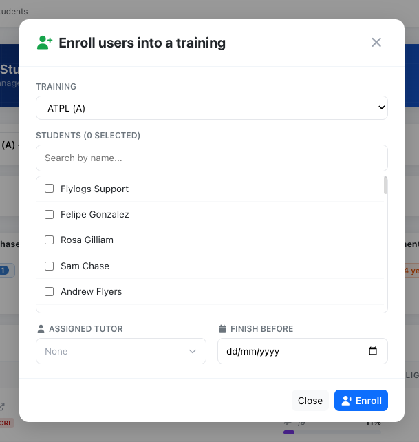
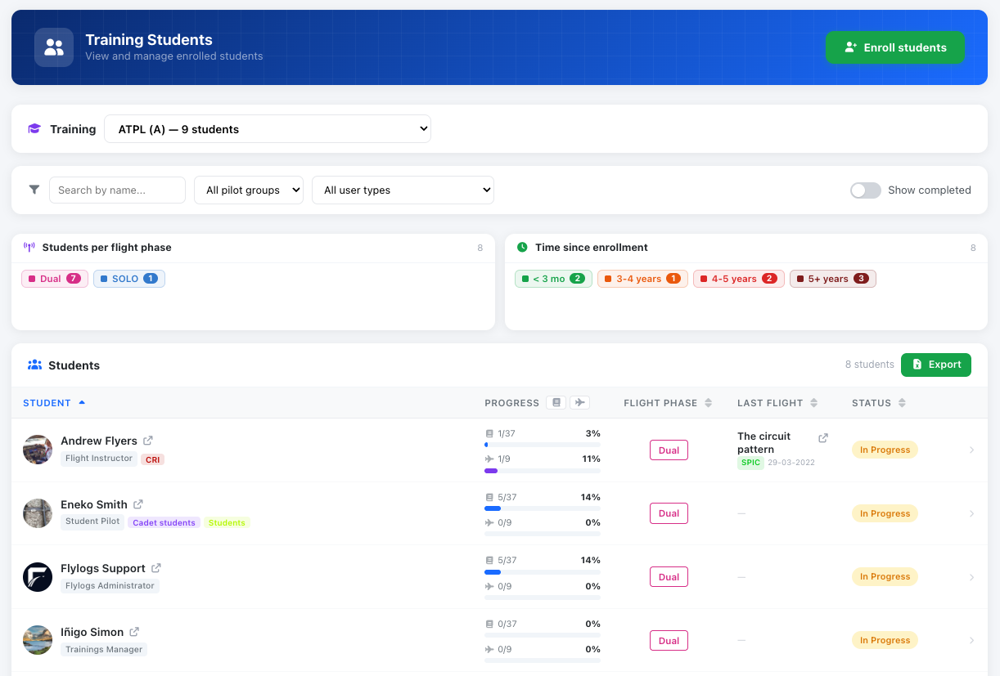
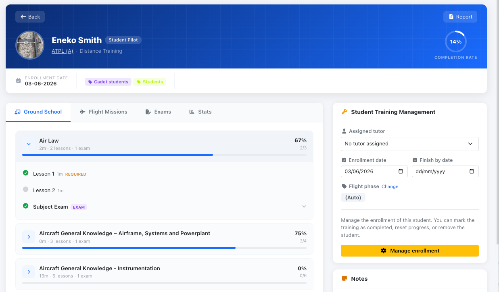
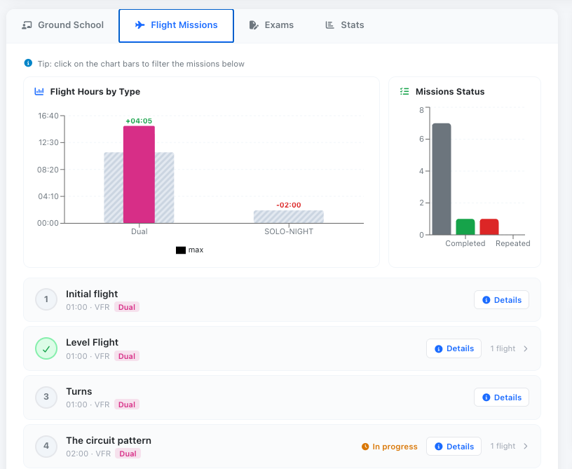
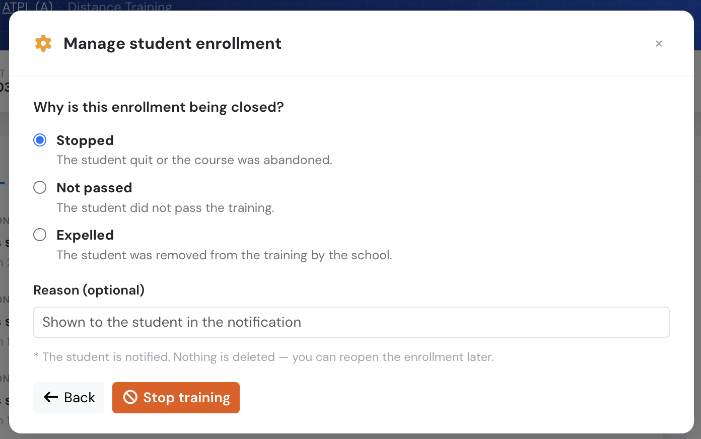

# Student management

Flylogs training allows any existing user in your company to be enrolled as a student. This means that any staff member, technical personnel, client, or student can be enrolled in a training program of your choice.

To get started, go to the "**Trainings**" menu tab and click on "**STUDENTS**." On this page, you'll see the students currently enrolled in the selected training. You can choose any of your trainings, and the list will update to display all existing students and their progress.

#### Enrolling new students

First, you'll need to add your students to one of your courses. To do this, click on the blue button labeled "Enroll students" in the top right corner. A small pop-up window will appear. In this window, you can choose students individually, or you can enroll an entire pilot group at once. We recommend creating pilot groups for each academic year and adding them in batches. This will make management easier, especially when you have multiple classes to oversee in the future.

Select the training in which you want to enroll the user(s). Additionally, you have the option to choose a tutor for the newly enrolled users or set a finish-by date if desired.

<figure><figcaption>
Enroll new students pop up window.
</figcaption></figure>
#### Students report page

Once you've enrolled at least one student, the current page will show a report detailing the progress of students enrolled in the selected training. This report, similar to the one in the screenshot below, provides essential information for tracking student progress. It includes details such as progress in theory learning lessons, flight training mission progress, attendance records, and the date of the last flight, if applicable.

<figure><figcaption>
Students report page
</figcaption></figure>
#### Student training progress page

You'll find a comprehensive training progress report page for each of your students. This page, as shown in the screenshot below, details progress and attendance in ground school lessons, exams, and flight missions. Additionally, it offers basic analytics to help you understand the strengths and weaknesses of each student.

Clicking on any of your students will open the complete progress report for that student in the selected training. Keep in mind that if a student is enrolled in more than one training, they will have a separate training report page for each training they are enrolled in.

These training reports for the student can also be accessed from the pilot profile page in the Trainings box.

<figure><figcaption></figcaption></figure>
<figure><figcaption></figcaption></figure>
#### Attendance breakdown

For onsite trainings, the attendance ring on the student's progress page breaks missed sessions down further, so a low attendance rate isn't a mystery:

* **Missed** — the total number of sessions the student did not attend.
* **Justified** — of those, how many have an approved absence justification.
* **Not justified** — how many are still a plain, unresolved absence.
* **Credited after class** — how many were later marked **Attended (post-class)**, i.e. the student made up the class afterwards.

The same split carries through to the training report and its PDF. See [Missed classes and class work](missed-classes-and-class-work.md) for how a student gets from "Absent" to one of these outcomes.

<!-- SCREENSHOT TODO — add trainingsAttendanceBreakdown.png to .gitbook/assets/, then uncomment:

<figure><figcaption>
Missed sessions split into justified, not justified and credited after class.
</figcaption></figure>

-->
#### Students invited but not enrolled

Someone can be invited to an individual class without being enrolled in the training itself — useful for a one-off visitor or a student you haven't formally enrolled yet. They can open the class page, but no attendance or evaluation can ever be recorded for them: on the class register they show up read-only with a **Not enrolled** label, and they're left out of the attendance ratio, the missed-class email and the class work notification.

They also won't appear on this training's student report or progress pages, since there's no enrollment to report on. To record their attendance and results, enrol them in the training — from that point on they're treated like any other student.

<!-- SCREENSHOT TODO — add trainingsNotEnrolledInvitee.png to .gitbook/assets/, then uncomment:

<figure><figcaption>
A "Not enrolled" invitee on a class register, shown read-only.
</figcaption></figure>

-->
#### Enrollment status: stopping, failing or expelling a student

Not every enrollment ends with a pass. When a student quits, is removed from the course, or does not pass, you can **close the enrollment without deleting any of their work** — every lesson, exam attempt and flight mission stays on record.

Open the student's training progress page, click "**Manage enrollment**" and choose "**Stop training**". Pick what happened and optionally write a reason:

| Status | Use it when |
|--------|-------------|
| **Stopped** | The student quit or abandoned the course. |
| **Not passed** | The student did not pass the training. |
| **Expelled** | Your school removed the student from the training. |

<figure><figcaption>
Choosing why an enrollment is being closed, with an optional reason for the student.
</figcaption></figure>
The student is notified in the app **and by email**, with the reason you typed included in the message. The same applies when you mark a training as completed or reopen an enrollment. Students who have turned alerts off, or whose email address is not confirmed, only get the in-app message.

Once an enrollment is closed:

- The student can no longer complete lessons or start exams in that training — their record becomes read-only.
- They stop appearing in the default student list, in their own list of trainings in progress, and in the pending trainings on their pilot profile. Use the status filter at the top of the students list to see them again.
- The enrollment no longer auto-completes, and no certificate is issued.
- You can enroll the same student in that training again — a fresh enrollment is created and the old one is kept for the record.

To resume a stopped student, use "**Reopen enrollment**" — either the button in the header of their training progress page, or the first option inside "**Manage enrollment**" (while an enrollment is closed, "Mark as completed" and "Stop training" are hidden there, since neither applies). Reopening puts the enrollment back in progress, notifies the student, and leaves every lesson, exam and mission exactly as it was.

Stopping, failing, expelling and reopening all appear in the student's **Activity** timeline as separate entries — each with the date, the reason given and the name of whoever made the change — so the full history is on the record, not just the latest state. The same trail covers the enrollment being created (who enrolled the student), a training completed automatically by the system, and a progress reset that reopened a closed enrollment. Removing a student deletes their enrollment and its history along with it, which is why stopping is the option to use when the record must be kept. That timeline is now also visible to the student on their own training page.

In **Trainings → Audit → Analytics** you get a Stopped card, a pie chart splitting the stopped students by outcome (stopped / not passed / expelled), and a "Recently stopped" list — most recent first, showing each student, their outcome, the reason given and the date, and linking through to their progress page.

> Stopping is not the same as "**Remove student**". Removing (unrolling) deletes the enrollment together with all of the student's lessons, exams and flight missions, and cannot be undone. Stopping keeps everything.

**Who can do this:** the same staff who can mark a training as completed or reset it — company managers. Instructors, students and external auditors cannot change an enrollment's status.
