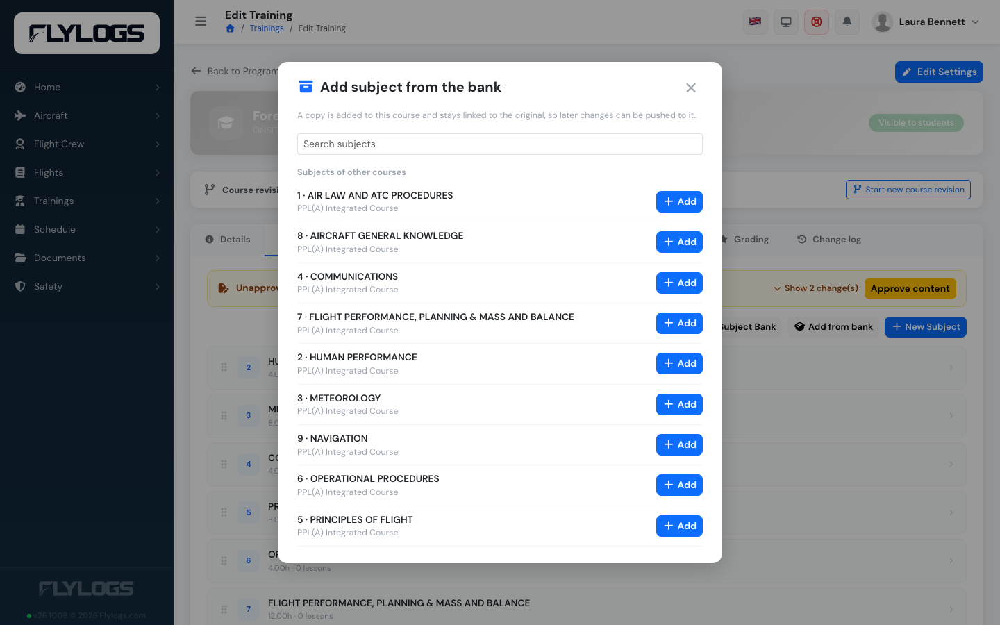
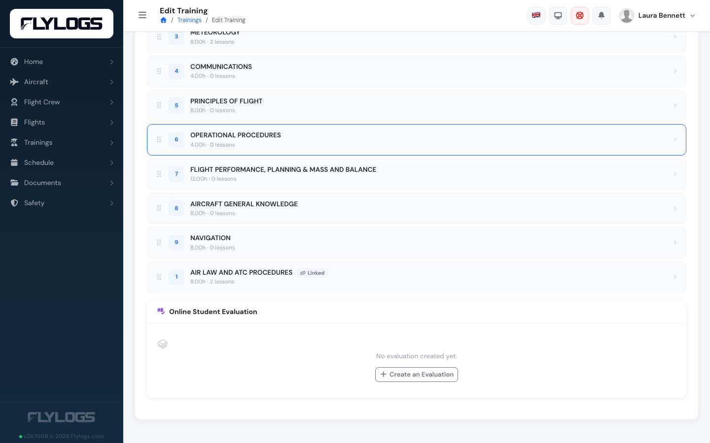
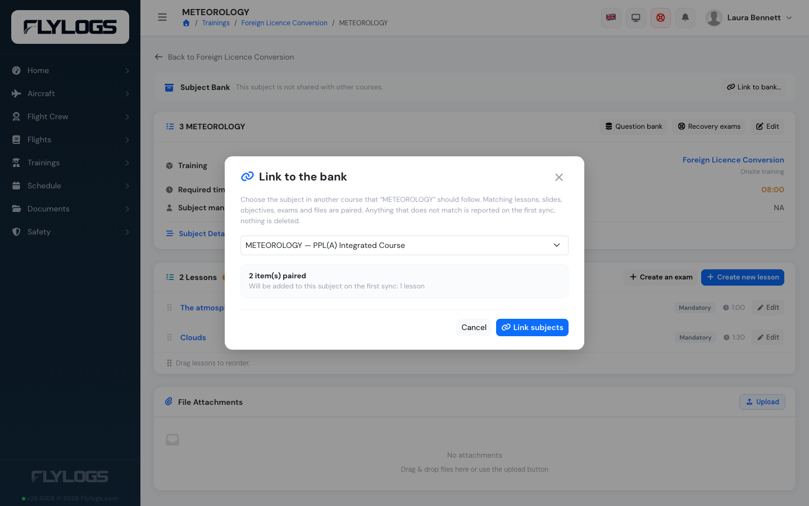
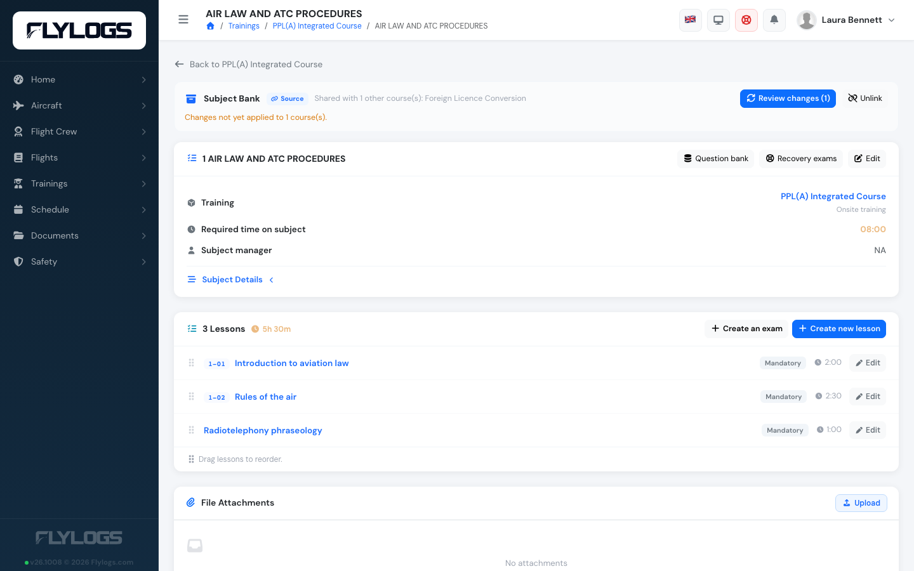
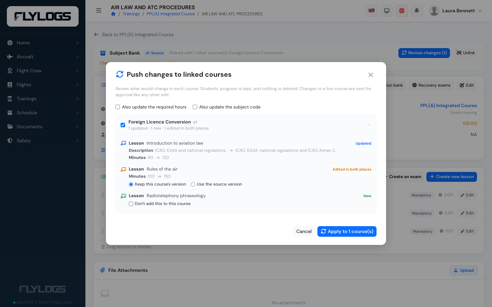
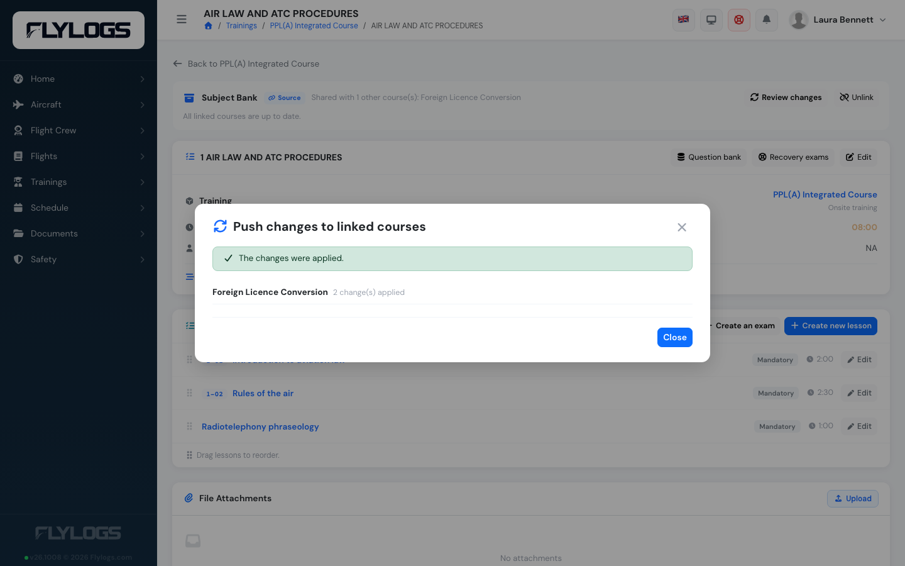
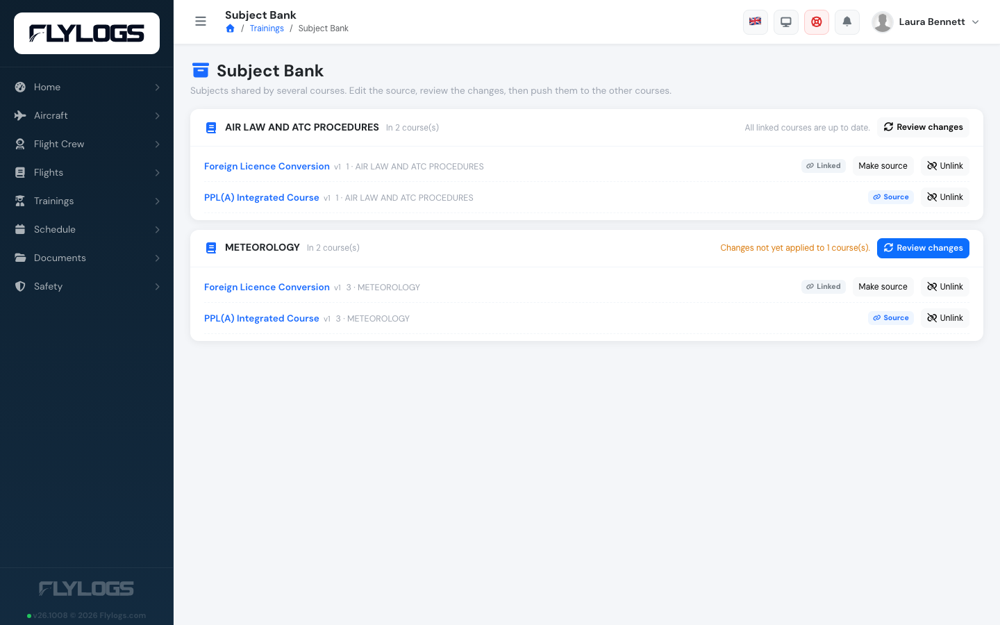

# Subject Bank (linked subjects)

Schools often teach the same subject — Air Law, Radiotelephony, Meteorology — in several courses. Without links, every content change has to be repeated by hand in each course. With the **Subject Bank**, the subject is **linked** across the courses: you edit it in one place, review what would change in the others, and push the changes.




**Every course keeps its own copy.** A linked subject is not one shared record. Each course has its own lessons, slides, exams, files and student progress. Linking only remembers which copies belong together. That is why students' progress, attendance and results are never touched by a push, and why you can still decide, course by course, what to accept.



**Who can do this.** Managers only (the manager roles above Crew Scheduling). Teachers and flight instructors keep editing their own subjects as usual, but cannot add, link, unlink or push from the Subject Bank, because a push changes several courses at once. Everything stays inside your own company. Superseded course revisions are read-only and are never listed or changed.


### Key ideas

* **Family.** The group of linked copies of one subject.
* **Source.** One copy of the family is the **source**. You edit the source and push *from* it. Any copy can be made the source later (**Make source**).
* **Push.** Changes only travel when you push them, after a review. Nothing is ever updated automatically.

### 1. Add a subject from the bank

Open the course, go to its **Subjects** tab and press **Add from bank**. Choose a subject of another course (shared subjects are listed first, then the other subjects of your company).

<figure><figcaption>
**Add from bank** on the Subjects tab lists the subjects of your other courses.
</figcaption></figure>

A **copy** is added at the end of the course and stays linked to the original. It brings its lessons and their order, slides, learning objectives, exams (with their questions) and attached files. The copy and the original are marked **Source** and **Linked** on the subject lists.
<figure><figcaption>
The new copy at the end of the subject list, marked **Linked**.
</figcaption></figure>

### 2. Link subjects you already have

If the same subject already exists in two courses, open the subject that should *follow* and press **Link to bank…**. Choose the subject it should follow (the source).

Flylogs shows a **preview** before anything is saved: lessons are paired by code, then by name, then by position; slides by position inside a matching lesson; learning objectives and exams by name; files by name. Items that have no partner are listed — what only the source has will be added on the first push; what only this subject has is kept. Nothing is deleted.

Press **Link subjects** to confirm.
<figure><figcaption>
The link preview: what pairs up, and what the first push will add.
</figcaption></figure>

### 3. Push changes to the other courses

Edit the source as usual. When a subject has linked courses that have not received your changes, its page shows how many (**Changes not yet applied to N courses**). Press **Review changes** (also available on the Subject Bank page).
<figure><figcaption>
The Subject Bank bar on the source subject: shared courses, and changes waiting for review.
</figcaption></figure>

For every linked course you see exactly what would happen:

| Result | Meaning |
|---|---|
| **Updated** | The source changed and the course did not: the course gets the new content, in place. |
| **New** | The source has a lesson, slide, objective, exam or file the course does not have: it is added at the end of the subject. You can tick **Don't add this to this course** — it will not be proposed again. |
| **Edited in both places** | Both the source and the course changed the same item since the last push. Choose **Keep this course's version** (the default) or **Use the source version**. |
| **Removed in source** | The source no longer has it. It is **kept** in the course; remove it yourself from the subject page if you want to. A warning shows when students have progress on it. |

<figure><figcaption>
The review: an updated lesson, a lesson edited in both places (with your choice), and a new lesson.
</figcaption></figure>

A course that edited something on its own while the source stayed unchanged is left alone — a deliberate local change is never overwritten.

Tick the courses to update and press **Apply**. Each course is updated separately, so a problem in one does not stop the others.

**What is not pushed by default.** The subject's required **hours** and **code** often differ per course, so they stay local. Tick **Also update the required hours** / **the subject code** to include them. The order of subjects and of activities, and the teacher, are never pushed.

<figure><figcaption>
After **Apply**, each course reports its result.
</figcaption></figure>

**Students keep their progress.** Lessons and exams are updated in place, so attendance, grades and exam attempts stay where they are. Exam questions are shared by reference: a push adds or removes the links the source has, and never touches other exams.

### Course revisions and approvals

A push to a **live course** counts as an edit of that course: it opens a [course revision](course-approvals.md) like any manual change, with a summary such as *Subject "Air Law" synced from "PPL"*, and goes through the same approval. A push to a **draft** course revision is applied directly. A push never changes a superseded revision.

When you start a new course revision, linked subjects **stay linked**: the new revision's copy remains in the family. If the subject was the source, the new copy becomes the source.

### Unlinking and deleting

* **Unlink** keeps the subject and all of its content, but it stops receiving pushes and is not part of the family any more.
* **Deleting** a linked subject removes it from the family. If it was the source, the oldest remaining copy becomes the source; a family left with a single subject dissolves.

### The Subject Bank page

**Trainings → Subject Bank** lists every family of the company with its courses, which one is the source, and how many courses have changes waiting. From there you can open a subject, **Review changes**, **Make source** or **Unlink**.
<figure><figcaption>
The Subject Bank page: every family, its courses and its source.
</figcaption></figure>

### Good to know

* Duplicating a course keeps its linked subjects linked. Copies of uploaded files get a readable name (`notes 2.pdf`), never a numeric prefix.
* If you rename or reorder things heavily before linking, the preview may pair fewer items; unpaired items are simply reported on the first push.
* Slide content changes are detected by comparing the stored slide; renaming a slide counts as a change too.
