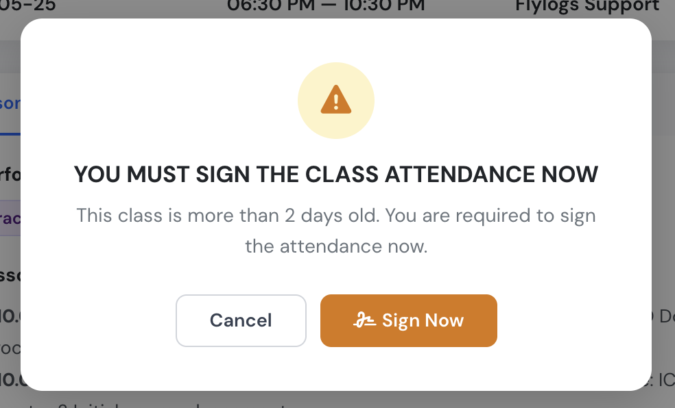

# Teacher tools

Once a class or exam is scheduled, the assigned teacher and students get access to the scheduled event page details. Additionally, the selected teacher and all company managers, can add some extra content to the event, communicate with students and rate them. \
\
**This is what teachers can do:**

**In regular lessons:**

* Add documents or files for the class
* Comment on and answer students' questions
* View and update the student list
* Record class attendance and evaluate student performance, add remarks and corrective measures if needed.

**In exams:**

* Record attendance
* View and update the student list
* Enter exam grades
* Comment on and answer students' questions

#### Class evaluation tool for teachers and managers:

<figure><figcaption></figcaption></figure>

The class teacher or any company manager can record attendance and enter evaluation details. Whether editing is allowed depends on who you are and whether the class has been signed off.

**Teachers** can edit attendance and exam results when:

* The class has **not been signed** yet, and
* The class was scheduled **no more than 3 days ago**

Teachers can also **sign** the class to lock the record once the session has taken place (the sign option becomes available up to 4 hours before the scheduled start time).

**Managers** (training manager, operations manager, and above) can edit attendance and exam results when:

* The class has **not been signed** yet — no time restrictions apply

**Once a class is signed, the record is locked** for everyone. A training manager can unlock it again with **Modify signed attendance**: confirm the prompt, make the correction, then **Update attendance** to sign again. Nothing is lost — every signature is kept as history, so you can always see who signed, and when, including earlier corrections.


A teacher who is also enrolled as a student in the same class will be treated as a student — their teacher editing rights are suppressed for that class.



Online exams are graded automatically and cannot be edited manually from the class page.


### Attendance statuses and signing

<figure><figcaption>
A class left unsigned for more than two days prompts the teacher to sign it.
</figcaption></figure>

Attendance isn't a tick box — each student on the register can be set to one of four statuses:

* **Attended**
* **Attended (post-class)** — used to credit a student who did not attend live but completed the class afterwards (see [Missed classes and class work](missed-classes-and-class-work.md)).
* **Absent**
* **Absent (justified)** — set automatically when a student's absence justification is approved (see below).

Before the class is signed, a student can simply be left **unmarked** — nothing is recorded for them yet. Attendance is only saved when you **sign** the class: signing turns every student still unmarked into **Absent**, and from that moment the register is a record, not a draft. Both **Attended** and **Attended (post-class)** count as present; **Absent (justified)** does not.

Signing automatically sends a missed-class email to every student marked **Absent**, with the class details and a link back to the class page. Each student gets that email once per class, even if you reopen and re-sign the register later — re-signing won't send it again to students already emailed.


Students invited to a class without being enrolled in the training appear on the register as **Not enrolled**, read-only. No attendance can be recorded for them and they're left out of the attendance count and the missed-class email — enrol them in the training first.


### Requesting class work

From the class page's **Documents** tab, a teacher can request class work (homework) from students: turn it on, set a deadline and write a description of what's expected. Students are notified and see a banner on the class page until they've dealt with it.

Once attendance is signed, the request is frozen — it can no longer be enabled, changed or cancelled. Students can still upload their work after signing, and the teacher and any training manager can review everyone's submissions from the same tab; each student only ever sees their own.


Class work is requested from the Documents tab, not while scheduling the class — see [Schedule a class or an exam](schedule-a-class-or-an-exam.md).


### Reviewing absence justifications

A student marked **Absent** can submit a justification — an explanation, a document, or both — from the class page's **Attendance** tab. The class teacher or any training manager reviews it there: **approve** it, which sets the student to **Absent (justified)**, or **reject** it, each with an optional note explaining the decision. A submission only gets one decision; if the student wants to make their case again, they submit a new one.


Class work files and justification documents can't be deleted or moved once uploaded, by anyone — they're the evidence behind an attendance decision.


#### Student evaluation pop up window:

<figure><figcaption></figcaption></figure>

Once attendance or exam results are recorded, they are stored in each student's training record. Managers can then access all attendance and exam records, along with a summary showing the percentage of attendance for the entire training program or per subject.

This information is also available to the student and is included in full detail in the training report that Flylogs creates for each student.
