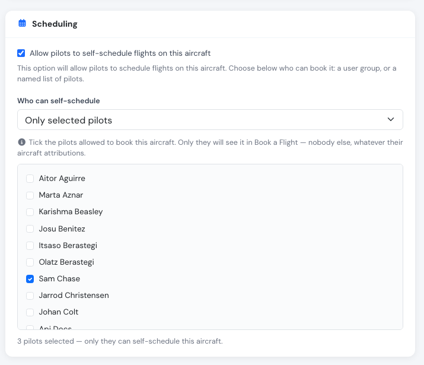
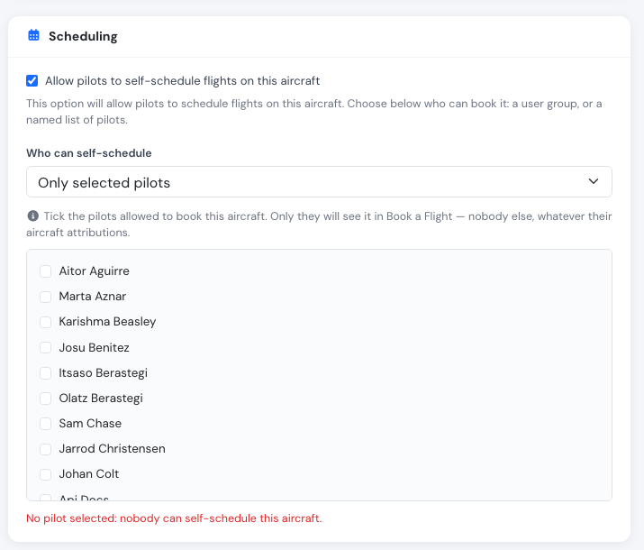
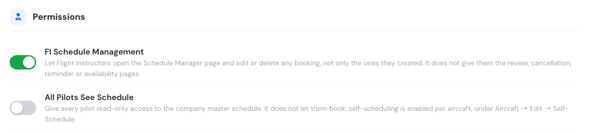

# New: reserve an aircraft for selected pilots

**September 2026** · Schedules & Fleet

An aircraft can now name the pilots allowed to self-book it. A co-owned aeroplane, a machine reserved for renters, a type only a few people are checked out on — open to those pilots, invisible to everyone else, without touching a single pilot profile.

***

### Why we built it

Self-scheduling had two switches: a checkbox that opened an aircraft to self-booking, and a dropdown that capped the **user group** allowed to use it — all pilots, certified pilots, instructors. Narrowing further meant going the long way round, through each pilot's **Aircraft Attributions**, where an empty list means *every* aircraft. Reserving one aeroplane for three people therefore meant editing everybody else in the school, one profile at a time, to tick every aircraft except that one.

Schools reasonably tried the obvious thing instead: unticking self-scheduling on the aircraft. That stops everybody — including the chief pilots the aircraft belongs to, who book through the same **Book a Flight** widget — so the aircraft had to be left open to the whole school.

***

### How it works

Open **Aircraft → edit → Scheduling**. **Who can self-schedule** has a fourth option, **Only selected pilots**, and a list of your active pilots underneath.

<figure><figcaption>
The aircraft names who may book it — no pilot profile is involved.
</figcaption></figure>

* Tick the pilots that may book the aircraft. Only they see it in **Book a Flight**, and only they can book it.
* The list lives on the aircraft and **overrides the pilots' Aircraft Attributions** for it. Naming a pilot is an explicit authorisation; it is not quietly undone by an attribution list set up years ago.
* **An empty list means nobody.** The reverse of the attributions convention, and deliberately so: the whole point is that the list says who is in, not who is out. The form says so in red when nothing is ticked.

<figure><figcaption>
Nothing ticked means nobody — never everybody.
</figcaption></figure>
* The list is kept when you switch to another access mode, so an aircraft can be opened to the school for a weekend and closed again without rebuilding it.
* Deactivating a pilot takes them out of self-booking without anyone editing the aircraft.

***

### Not only booking

Pair it with **All pilots see schedule** switched off in **Company settings → Schedule** and those pilots see *only* that aircraft's schedule — their aeroplane, their bookings, nothing about the rest of the fleet. Managers keep the full view.

<figure><figcaption>
<strong>Company settings → Schedule → Permissions</strong>.
</figcaption></figure>

***

### Where you'll see it

The rule is applied when the booking is saved, not only when the aircraft list is drawn, so it is a real restriction rather than a filter: a booking that reaches the server for an aircraft the pilot is not named on is refused with *"You are not allowed to self schedule …"*.

See [Self scheduling → Reserving one aircraft for a few pilots](../schedules/self-scheduling.md#reserving-one-aircraft-for-a-few-pilots) for the full reference.
