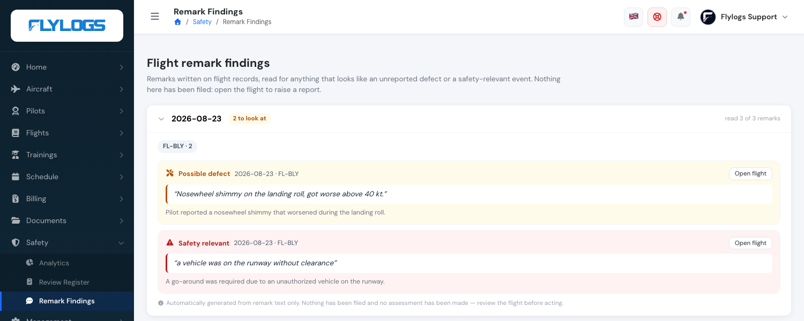

# New: Flylogs reads your flight remarks

**September 2026** · Safety

Pilots write things in the remarks box that never become a report. A brake that felt spongy. A go-around because a vehicle was on the runway. A warning light that came on and went out again. Written at the end of a long day, filed with the flight, and then read by nobody.

Flylogs now reads those remarks every day and points out the ones that look like they deserve a second look. You will find them under **Safety → Remark Findings**.

***

### It reports nothing

This is the part worth being clear about, because it shaped everything else.

The list creates **no aircraft report, no safety report, no maintenance job, and no notification**. It does not assign anything to anyone. It does not decide how serious something is or what caused it.

If a finding deserves a report, you open the flight and raise it the way you always have. Your registers stay a record of decisions people made — which is what makes them worth having.

***

### You can check every finding in one glance

Each finding shows the remark **exactly as the pilot wrote it**. Not a summary of it, not a tidied-up version — the words themselves.

That is deliberate, and it is enforced rather than hoped for: if the quoted words are not literally present in the remark, the finding is discarded instead of shown. So you can judge any finding by reading the quote, without having to trust the interpretation sitting under it. **Open flight** takes you to the record.

***

### It tells you how much it actually read

Every day shows a line like *read 9 of 40 remarks*.

Most remarks are not prose. They are `5T`, `NIL`, `Private flight`, or a route typed back into the box — operational shorthand, not observations. Those are filtered out before anything is read, which is why the two numbers rarely match.

Showing both was a deliberate choice. A list that quietly looked at nine remarks and presented itself as a review of forty would be worse than no list at all.

**Nothing flagged** is a normal result. On most days nobody wrote anything that needs attention, and the page says so plainly.

***

### Who sees it

Managers only — management, safety and maintenance roles. Pilots and students cannot open the page.

These are remarks your crews wrote, shown back with a reading attached. That belongs to the person doing the triage, not to the person who wrote the remark.

***

### Honest about what it is

It is an automated reading of free text. It will sometimes point at something ordinary, and it will sometimes miss something real. It is one more pair of eyes on a pile of text nobody was reading at all — not a replacement for any part of your safety process.

Full details in [Flight remark findings](../sms/flight-remark-findings.md).
