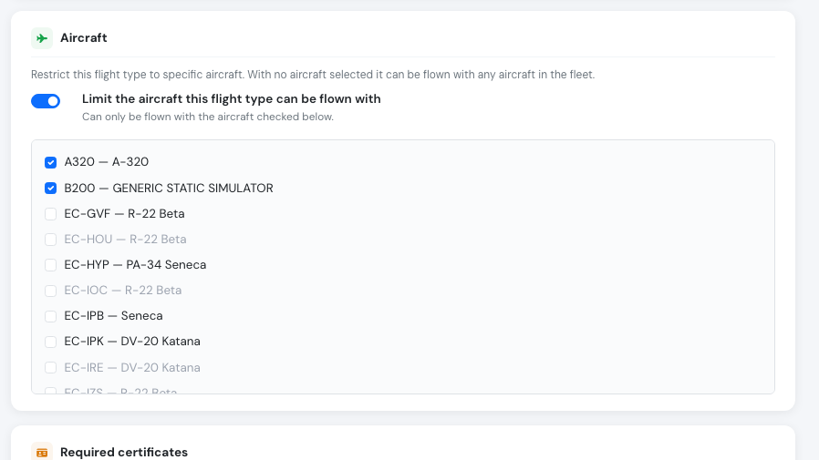
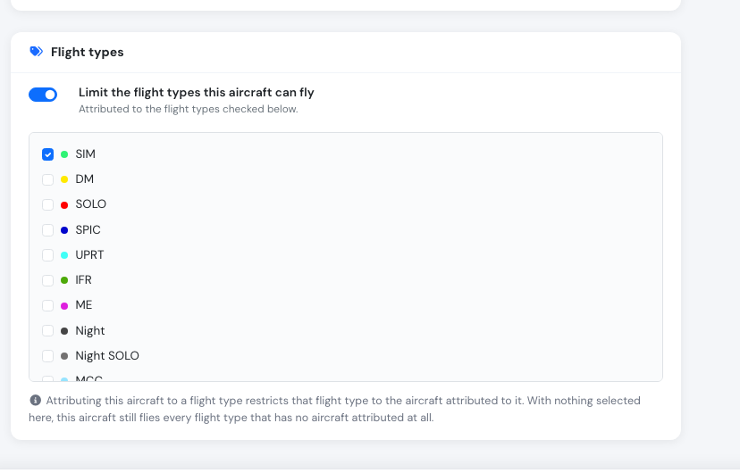

# New: restrict a flight type to specific aircraft

**September 2026** · Flights & Fleet

A flight type can now be tied to the aircraft it actually belongs on. A simulator type on the simulators, a multi-engine type on the twins, a tow type on the tug — instead of every flight type being offered on every aircraft in the fleet.

The same release moves the flight type form out of its pop-up and onto its own page.

***

### Why we built it

Flight types drive logbook credit, scheduling and crew requirements, but until now they had nothing to say about metal. A school with two simulators, four singles and a twin offered all of its types on all of its aircraft, and the only thing stopping *ME* being logged on a Katana was somebody noticing. The mismatch surfaced late — in a logbook, a report, or an audit — rather than at the moment of choosing.

***

### How it works

Open **Flights → Flight types** and edit a type. The new **Aircraft** card has one switch and a list.

<figure><figcaption>
The <em>SIM</em> type restricted to the two simulators.
</figcaption></figure>

* **Switch off (the default).** No aircraft attached — the type can be flown with **any** aircraft in your fleet. Every flight type you already have is in this state and stays there; nothing changed for them.
* **Switch on, aircraft ticked.** The type can **only** be flown with the aircraft you ticked.

An empty list is "no restriction", never "no aircraft allowed" — the same convention [pilot attributions](../crew-management/pilot-attributions.md) already use. Two details that follow from it:

* **Ticking every aircraft is not the same as ticking none.** The full fleet ticked is still a closed list, so an aircraft bought next year will not be able to fly that type until someone adds it. If you mean "anything", leave the switch off.
* **Parking an aircraft keeps it on the list.** Marking an aircraft inactive does not quietly widen a restriction; the link waits for it to come back.

Restricted aircraft show as green tags under the type in the flight types list, so the fleet mapping is readable without opening every type.

<figure><figcaption>
<em>SIM</em> and <em>ME</em> carry an <strong>ONLY ON</strong> tag; the rest have none and fly with the whole fleet.
</figcaption></figure>

***

### Or set it from the aircraft

The aircraft edit page gained a matching **Flight types** card, so you can approach it from whichever end is quicker — one type across two simulators, or one newly delivered aircraft across the three types it may fly.

<figure><figcaption>
The B200 simulator, attributed to the <em>SIM</em> type.
</figcaption></figure>

It is one relationship seen from two sides, so a change in either place shows up in the other. The empty state keeps the flight type's meaning rather than the aircraft's: an aircraft with nothing ticked is **not** grounded — it flies every flight type that has no aircraft attributed at all, which is the normal state for most of a fleet.

***

### The flight type form is now a page

Creating or editing a flight type used to open a pop-up. It now opens as a full page, with each group of settings on its own card — basic information, pilot time classification, default flight condition, aircraft, required certificates, visibility.

<figure><figcaption>
Each group of settings on its own card, with the time-classification reference in view on the right.
</figcaption></figure>

Practically: more room as flight types keep gaining settings, a link you can send someone, and a browser back button that behaves.

***

### Rolling out

This release stores, displays and manages the restriction from both pages. Applying it to the aircraft picker on the flight form and in the schedule editor is the next step — until then those pickers still offer the whole fleet.

See [Flight Types → Aircraft](../flights/flight-types.md#aircraft) for the full reference.
