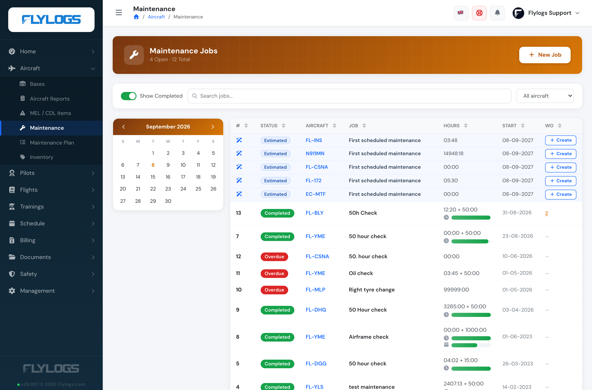
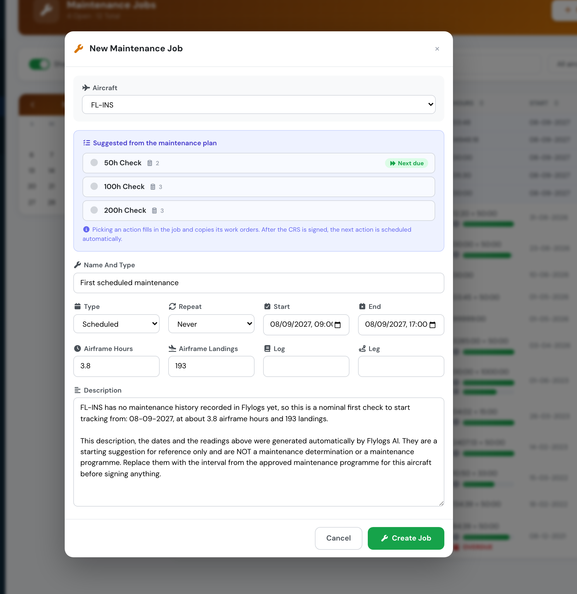

# New: Flylogs tells you when the next check is due

**September 2026** · Fleet & Maintenance

Every aircraft now carries an estimate of when its next maintenance will fall due, worked out from its own flying history — and that estimate shows up where you actually plan: the aircraft page, the Schedule Manager calendar, your upcoming flights, and the flight form.

Booked work always wins. If the shop has a job on the calendar, that is what you see. The estimate only fills the gap where nothing is booked yet.

***

### Why we rebuilt it

The aircraft page has predicted a next-maintenance date for a while, and it was wrong often enough that people stopped reading it. The reason turned out to be seasonal.

The old estimate measured how fast an aircraft was flying over a short recent window. Ask it on 1 September, and the window it measured was largely August — the month a flying school does roughly **half** its normal hours. The aircraft looked idle, so the check looked months away, and then it arrived in October with nothing booked.

We backtested the fix against real fleet data: 99 aircraft, 838 forecast dates over five years, each one compared against what actually happened. The old method was off by a median of **25 days**, and **39 days** when asked in September. The new one is off by **14 days**, and **9 days** in September.

We also tried the two obvious clever fixes — sampling the same weeks from previous years, and a statistical simulation for the confidence range — and measured both as *worse* than the simple thing. They are not in the product. What is in the product is a blend of the last 90 days and the last 12 months of flying, which contains exactly one August and therefore handles the quiet season without being told about it.

***

### Where you'll see it

**On the aircraft page**, a card with the predicted date, the check it refers to, and the likely window. If the aircraft has already run past an interval it turns red and says how many hours over it is.

**In the Schedule Manager calendar**, aircraft with nothing booked get a blue all-day marker on their estimated date. It is a suggestion: it overlaps freely, raises no conflict, and will not stop you booking a flight that day. Aircraft that *do* have work booked keep the amber block that blocks the slot, exactly as before — nothing changed for them.

**On your Schedules page**, under your upcoming flights, one line per aircraft you are booked on. So nobody turns up to a flight on an aircraft that is about to go into the shop.

**In the flight form**, under the maintenance hours bar you already use.

**In the maintenance jobs list**, aircraft with nothing booked get a suggestion row at the top — light blue, with a ✨ icon and an **Estimated** badge so it reads as a suggestion and not a job — and a **Create** button.

<figure><figcaption>
Predicted rows sit above the real jobs, tinted and badged. Nothing else about the list changed — except the <em>Type</em> column, which we dropped to give the rest more room.
</figcaption></figure>

***

### One click from prediction to job

**Create** opens the normal new-job form with everything filled in: the aircraft, the name of the check that is actually due, a working day on the predicted date, and — the part that is easy to get wrong by hand — the airframe hours and landings the aircraft is expected to have **on that date**, not the ones it has today.

If the aircraft is on a maintenance plan, the suggestion **is** that plan's action: the row is named after it, the form opens with it already selected in the plan panel, and saving copies its work orders and links the job to the plan. That also keeps the chain going — jobs are matched back to their plan by name, so the next forecast finds this one.

That distinction matters more than it looks. A job carries the reading it was raised at, and the next interval counts from there. Fill in today's counter and every following cycle starts short by whatever the aircraft flies in the meantime.

The description is written for you, and it says out loud that the dates and readings were generated by Flylogs AI and are a reference, not a maintenance determination — so the next person to open that job card knows exactly what they are looking at. Everything is editable, and nothing exists until you press **Create job**.

<figure><figcaption>
Opened from the suggestion for FL-INS: an aircraft with no maintenance history, so the form offers a nominal first check twelve months out at the readings it is expected to have by then.
</figcaption></figure>

Everywhere, a **Scheduled** tag means the shop booked it and an **Estimated** tag means we worked it out. The estimate never blocks anything, anywhere.

***

### It follows your maintenance plan

If an aircraft is attached to a maintenance plan, the plan is what decides — not whatever the last job card happened to carry. Each plan action is anchored to the last time it was completed, and its hours interval, landings interval and repeat period are all counted forward from there. Whichever lands first is the one you are shown.

That is what makes it work for aircraft that flight hours say nothing about. A simulator on a **monthly** plan is due a month after the last one, whatever it has been used for — and if that month has already passed, it is reported as overdue and the suggested job opens dated today.

Plans win only for the checks they own. An aircraft on an annual plan that also runs 50-hour checks as ordinary jobs keeps both forecasts.

***

### Never recorded any maintenance? You still see it working

If a company has no maintenance jobs on file, every aircraft still gets a suggestion — a nominal first check at the next **50 flight hours**, the next **50 sectors**, or **12 months** out for an aircraft that is not flying. They are labelled *First scheduled maintenance* and *No maintenance history — suggested starting point*, and they are a starting point for tracking rather than a maintenance programme.

The moment a real job is signed off with an interval, that aircraft switches to its own history and the nominal figures go away.

***

### The likely window

Alongside the date you get a range — *"Likely between 19 Sep and 29 Oct"*. That range is calibrated against real history rather than assumed: measured out of sample, the true date lands inside it about **8 times out of 10**.

Read the date to plan and the range to judge the plan. A narrow range is a steady aircraft. A wide one means utilisation has been uneven and the check could land noticeably either side.

***

### What it will not do

It does not know about calendar items you have not recorded as a job — the ARC, the annual, life-limited parts. Record them with an expiry date and they are taken into account; leave them out and the hours estimate cannot see them.

And it reports what your data says. If nobody has signed off a check for a long time while the aircraft kept flying, it will tell you the aircraft is overdue. In our own test data that flagged two aircraft whose jobs had simply stopped being recorded — which is worth knowing either way.

It is a planning aid. The authority on when an aircraft is due remains the job card and the CRS.

See [Aircraft maintenance → Next maintenance forecast](../aircraft/aircraft-maintenance/next-maintenance-forecast.md) for the full reference.
