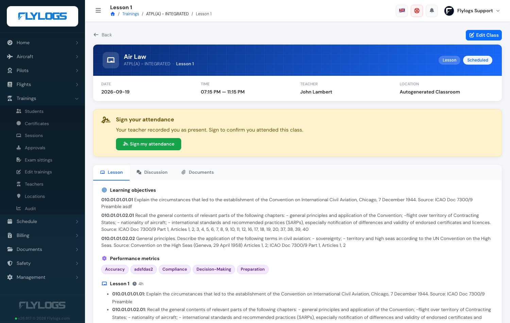

# New: Student attendance signatures

**September 2026** · Training courses

Students can now countersign their own attendance for a theory class, the way they sign a flight debrief. The course setting that asks for it — **Require students to sign assistance** — finally does something.

***

### Why we built it

The setting has been on the training settings page for a while, and schools have been switching it on expecting exactly what it says: the student confirming, in their own name, that they attended. Students were even being asked to sign by an automatic message — but there was nowhere to actually do it. This closes that loop, and makes the class register an artefact both sides have signed.

***

### How it works

* **Off by default, per course.** Nothing changes on a course that doesn't ask for signatures — no request, no signature, no column on the report. The option covers onsite and remote courses; distance courses don't use it.
* **Asked when attendance is recorded.** The moment a teacher marks a student **Attended** or **Attended (post-class)** and saves, that student is asked to sign. Once per class, however many times the register is saved afterwards.
* **Signed with a password.** The student opens the class page, presses **Sign my attendance** and confirms with their own password. The signature is stored with its date and time.

<figure><figcaption>
The student's class page, asking for the signature.
</figcaption></figure>
* **Seven days to sign.** The window opens four hours before the class and closes seven days after it. **The teacher signing the register doesn't close it** — their signature certifies who was there, the student's confirms they were, and the two are independent.
* **Absent students are never asked.** There's nothing for them to attest. Their justification and class-work options are unchanged.
* **Always says why.** When a student can't sign, the class page tells them which of it is: too early, too late, not recorded as attended, or already signed.
* **On the record.** The signature date appears under the student's name on the register, and the class report PDF gains a **SIGNED** column on courses that require it.

***

### Where it fits

It sits alongside the teacher's own signature in the existing attendance flow — the register in the **Attendance** tab, the class report PDF, and the missed-class follow-up for everyone who wasn't there.

***

### Turning it on

<figure><figcaption>
Training settings → Require students to sign assistance.
</figcaption></figure>

Training settings → **Require students to sign assistance**. Existing classes are unaffected; the request goes out the next time attendance is recorded.

***

Read the full guide: [Teacher tools](../training-courses/teacher-tools.md) and [Missed classes and class work](../training-courses/missed-classes-and-class-work.md).
